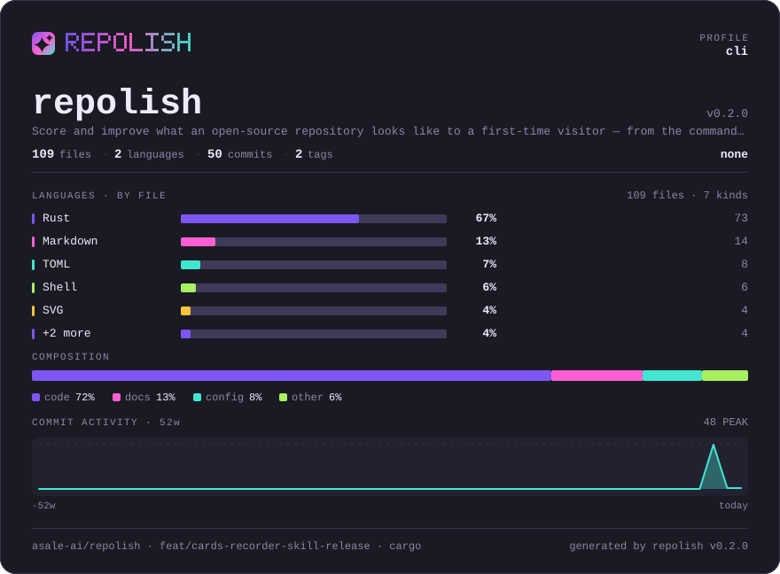
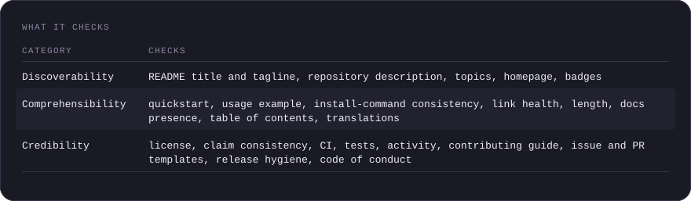
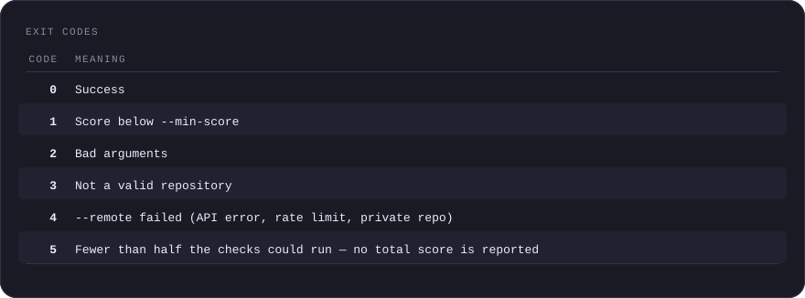
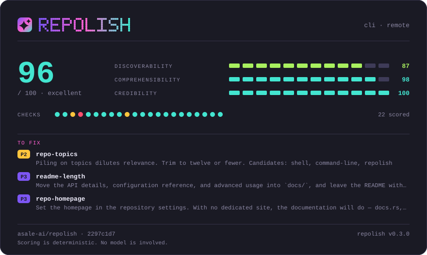

<p align="center">
  
</p>

# repolish

**Score and improve what an open-source repository looks like to a first-time visitor — from the command line.**

[](https://crates.io/crates/repolish)
[](https://github.com/asale-ai/repolish)
[](https://github.com/asale-ai/repolish/actions/workflows/ci.yml)
[](#license)
[](docs/README.md)

[English](README.md) · [中文](README.zh-CN.md)



repolish reads a repository the way a stranger does, scores 22 concrete signals, and for
every point it deducts it names the file, the line, and what to write instead. Then it
fixes what can be fixed mechanically.

Two rules keep the number worth trusting. **No model in the scoring path**, so the same
commit always produces the same score. And **it says when it does not know**: a check it
cannot decide is reported as *not verified* and excluded, never guessed at.

## Contents

- [Install](#install)
- [The one command](#the-one-command)
- [What it does](#what-it-does) — the four stages
- [Controlling it](#controlling-it)
- [Configuration](#configuration)
- [In CI](#in-ci)
- [Cards and recordings](#cards-and-recordings)
- [For coding agents](#for-coding-agents)
- [What it checks](#what-it-checks)
- [How scoring works](#how-scoring-works)
- [Exit codes](#exit-codes)
- [Status](#status)
- [Contributing](#contributing)
- [License](#license)

## Install

```bash
npx @asale/repolish
```

Nothing to install, and it works wherever Node does. The package is a launcher, not a
reimplementation: it downloads the release binary for your platform, verifies its
`.sha256`, and runs it — the checks are a single static Rust binary either way.

<details>
<summary>The other four ways</summary>

**Globally with npm**, for `repolish` on PATH:

```bash
npm install -g @asale/repolish
```

**One line**, which also drops the [agent skill](#for-coding-agents) into whichever agents
it finds on the machine:

```bash
curl -fsSL https://raw.githubusercontent.com/asale-ai/repolish/main/install.sh | sh
```

Same download and `.sha256` check, into `~/.local/bin`. POSIX `sh`, about 200 lines — read
it first if you would rather not pipe a script into a shell. `REPOLISH_VERSION`,
`REPOLISH_BIN_DIR` and `REPOLISH_TARGET` override the defaults.

**With cargo**, needing Rust 1.88 or newer:

```bash
cargo install repolish
cargo install --git https://github.com/asale-ai/repolish repolish  # unreleased main
```

**The archives themselves**, five targets each with a `.sha256`, are on the
[releases page](https://github.com/asale-ai/repolish/releases).

</details>

Linux builds are glibc-only. On musl the installers say so and stop rather than leaving a
binary that cannot run; use `cargo install repolish` there.

**Every command below uses `npx @asale/repolish`**, which needs nothing installed. Note
that npx does not put `repolish` on your PATH — it downloads into a cache and runs it. If
you did install it globally (npm, cargo, or the script above), drop the prefix and run
`repolish` instead; the arguments are identical.

## The one command

```bash
npx @asale/repolish
```

**There are no subcommands, and nothing is written.** It scores the repository, then
reports every file it would create or change:


<sup>Recorded by repolish itself against [demo/sample](demo/sample), a repository written
badly on purpose; both scores in it are whatever that run actually produced. Why it is
re-recorded by hand: [demo/README.md](demo/README.md).</sup>

<details>
<summary>What a run looks like, as text</summary>

```text
  acme/taskvault  · cli (detected) · local · 52d9d0e4

  SCORE   23 / 100    poor        ▄▄▄▄▄▁▁▁▁▁▁▁▁▁▁▁▁▁▁▁▁▁▁▁

  DISCOVERABILITY    ▄▄▄▄▄▄▁▁▁▁▁▁   56
  COMPREHENSIBILITY  ▄▄▄▁▁▁▁▁▁▁▁▁   28
  CREDIBILITY        ▄▁▁▁▁▁▁▁▁▁▁▁   13

  CHECKS  ●○○○●●●○○●●●●●●●●●●●●●   17 scored · 5 not verified

  ── TO FIX ──────────────────────────────────────────────────────────────

   P1  license
       Add a LICENSE file. No license means all rights reserved — legally,
       nobody may use your code
       └ .  no LICENSE file in the repository root

  WOULD WRITE (6 files)
    .github/ISSUE_TEMPLATE/bug_report.yml       new file
    .github/ISSUE_TEMPLATE/feature_request.yml  new file
    .github/pull_request_template.md            new file
    CONTRIBUTING.md                             new file
    .repolish/badge.json                        score badge
    .github/workflows/repolish.yml              CI workflow

  Nothing was written. Apply with: npx @asale/repolish --apply
```

</details>

Three things there are the point of the tool. **`README.md:8`** — every deduction names a
file and, where there is one, a line. **`5 not verified`** — checks it could not decide are
never folded into the score as if they had passed. And **`local`** — the report says which
baseline produced it, because a local score and a `--remote` one are not comparable.

When the plan looks right:

```bash
npx @asale/repolish --apply
```

That is the whole workflow. `--apply` **only inserts**: the diff is new lines and nothing
else, so your tabs, list markers, reference-style link definitions and line endings survive
byte for byte. It refuses to run outside a git repository unless you pass `--force`,
because `git checkout` is the undo button.

## What it does

Four stages, in order. The order matters: `polish` may insert a reference to a card, and
`artifacts` is what draws it.

| Stage | What it does |
|---|---|
| `check` | Score the repository and print the report |
| `polish` | The fixes that follow mechanically: the badge, a table of contents built from your own headings, GitHub issue and PR templates, and a `CONTRIBUTING.md` whose commands come from your detected package manifest |
| `artifacts` | Write `.repolish/badge.json`, draw the banner and the two cards, and redraw every SVG the README already references |
| `ci` | Write `.github/workflows/repolish.yml` |

**Where it cannot know, it does not write.** No manifest means no `CONTRIBUTING.md`,
because the alternative is `<your build command here>` — a file that turns the check green
while the problem stays where it was. Existing files are left alone; `--force` regenerates
them.

Two more stages exist but are **not** in the default run, deliberately:

| Stage | Why it is opt-in |
|---|---|
| `skill` | Writes `SKILL.md`, which only matters if you use coding agents |
| `demo` | **Runs** the commands it records, which is not something a default should do. A run that skipped it says so at the end |

## Controlling it

```bash
npx @asale/repolish --stages check                 # score only, write nothing
npx @asale/repolish --stages check,polish --apply  # fix, but no badge JSON and no CI workflow
npx @asale/repolish --stages demo --apply          # record the animation
npx @asale/repolish -v                             # P3 suggestions, passing checks, full file contents
npx @asale/repolish --remote                       # also read description / topics / homepage from GitHub
```

`--remote` reads `GITHUB_TOKEN` or `GH_TOKEN`; without one, the anonymous quota is 60
requests per hour.

```bash
npx @asale/repolish --format json              # schema frozen at version 1
npx @asale/repolish --only license,ci-present  # run just these checks
npx @asale/repolish --skip repo-topics         # run everything except this
```

`--format` accepts `text` (the default), `json`, `markdown`, `sarif` and `comment`. In
every format but `text`, **stdout carries only the report** and everything procedural goes
to stderr, so `npx @asale/repolish --format json | jq` works on a full run.

Three findings are deliberately left for you: the tagline, the quick start and the usage
example. No mechanical rule can satisfy them. A model can draft them, and only them:

```bash
npx @asale/repolish --suggest  # needs REPOLISH_LLM_API_KEY, or ANTHROPIC_API_KEY
```

`--suggest` **never writes**, not even with `--apply`; it **only fills gaps**; and it
**cannot invent** — it is told to leave a suggestion empty rather than make one up. It does
not move a score. [Why those three](docs/04-usage.md).

## Configuration

Anything you would otherwise repeat on the command line goes in `.repolish.toml` in the
repository root. The command line always wins, and an unknown key is an error, not a
silent no-op.

```toml
profile   = "cli"      # override the detected project type
min_score = 70         # same as --min-score

[checks]
skip = ["repo-topics"]

[readme]               # how the insertions look. None of this moves a score.
toc-style = "fold"
theme     = "porcelain"

[suggest]              # which model drafts the suggestions. No API key here: this file is committed.
model = "claude-sonnet-4-5"
```

Per-check thresholds are deliberately not configurable: letting every repository tune its
own would make scores incomparable between repositories, which is the reason this tool
exists. [The full key list](docs/04-usage.md).

## In CI

The `ci` stage writes a workflow with two jobs: one on pushes that records the score and
commits the badge, one on pull requests that reports **what the change did** to the score,
uploads SARIF so each finding lands on its own line in the diff, and posts a comment.

```bash
npx @asale/repolish --stages ci --min-score 70 --apply
```

To wire it up by hand, the action takes the threshold directly:

```yaml
- uses: asale-ai/repolish@v0.4.1
  with:
    min-score: 70
  env:
    GITHUB_TOKEN: ${{ secrets.GITHUB_TOKEN }}
```

Anywhere else the exit code is the gate: `npx @asale/repolish --stages check --remote --min-score 70`.
Exit 1 means the score was too low; exit 4 means the GitHub call failed — deliberately
different, so a rate limit never reads as a regression. On a pull request the *change* is
the story:

```bash
npx @asale/repolish --stages check --base origin/main      # report the difference against a ref
npx @asale/repolish --stages check --sarif repolish.sarif  # one annotation per finding, on its line
npx @asale/repolish --stages check --comment comment.md    # the short form, for a PR comment
```

`--sarif` and `--comment` write even without `--apply`: you named the path, so that is the
request, not a change to your repository.

[How each behaves](docs/04-usage.md) · [the Action's inputs](action/README.md)

## Cards and recordings

```bash
npx @asale/repolish --apply                     # cards and SVG tables are included
npx @asale/repolish --apply --no-visuals        # leave the README's visuals alone
npx @asale/repolish --stages artifacts --apply  # redraw everything already referenced
npx @asale/repolish --stages demo --apply       # record the CLI as an animated SVG
```

Everything repolish draws is a **self-contained, deterministic SVG**, and a plain file in
**your** repository — so it cannot go 404 on you, rate-limit you, or log who read your
README. The overview card belongs at the top, under the badges; the report card belongs at
the [end](#polished-with-repolish), because at the top the first thing a visitor sees would
be our tool grading your project instead of your project.

`polish` inserts each reference once; `artifacts` redraws the file every run after that, so
the image never goes stale. Pick a single one with
`--artifact badge,report,hero,overview,score,tables`. The banner carries **your** project's
name — a name the block font cannot draw (non-Latin, or simply too long) falls back to
plain text rather than rendering blank.
The rest — `--theme`, `--lang`, why `--stars` only works on repositories you administer,
why `demo` really runs the commands it records — is in
[docs/02-cli-design.md](docs/02-cli-design.md).

## For coding agents

Ask an agent to "improve this README" and its first move is to rewrite the whole file,
replacing the author's voice and examples with something that reads like every other
README. That is exactly the failure this tool exists to prevent.

```bash
npx @asale/repolish --stages skill --list                   # which agents are installed here
npx @asale/repolish --stages skill --target detect --apply  # install into the ones that are
npx @asale/repolish --stages skill --apply                  # or write SKILL.md into a repository
```

[skills/repolish/SKILL.md](skills/repolish/SKILL.md) is the file to hand to Claude Code,
Codex, Gemini, OpenCode or anything reading `AGENTS.md`. Beyond the command surface it
carries the order — **measure, apply what is mechanical, hand back what needs judgement,
measure again**.

## What it checks

22 checks in three categories. Three of them need `--remote`. Full definitions and
weights: [docs/03-scoring.md](docs/03-scoring.md).



<details>
<summary>What it checks as a table</summary>

| Category | Checks |
|---|---|
| **Discoverability** | README title and tagline, repository description, topics, homepage, badges |
| **Comprehensibility** | quickstart, usage example, install-command consistency, link health, length, docs presence, table of contents, translations |
| **Credibility** | license, **claim consistency**, CI, tests, activity, contributing guide, issue and PR templates, release hygiene, code of conduct |

</details>

**Claim consistency** is the one no other tool does: `npm run build` must be in
`package.json`, `make test` must be a real target. A README that fails on its first command
is where readers leave. It catches renames and deletions — the command that quietly stopped
existing.

## How scoring works

Each check returns 0–10 and carries a risk weight; the total is the weighted average.
Checks that end up *not applicable*, *inconclusive* or *skipped* are excluded from the
denominator rather than counted as passes — and **if less than half the total weight could
be scored, no total is reported at all**, because "we checked three things and they passed"
must not read as 100/100. Weights, thresholds and the aggregation rules are in
[docs/03-scoring.md](docs/03-scoring.md).

## Exit codes

Tool failure and "checks did not pass" are deliberately different codes.



<details>
<summary>Exit codes as a table</summary>

| Code | Meaning |
|---|---|
| 0 | Success |
| 1 | Score below `--min-score` |
| 2 | Bad arguments |
| 3 | Not a valid repository |
| 4 | `--remote` failed (API error, rate limit, private repo) |
| 5 | Less than half the total weight could be scored — no total score is reported |
| 7 | `--base` could not be resolved: shallow clone, unknown ref, no git |

</details>

## Status

Everything described above is shipped, the wording suggestions included.

The check set and the JSON schema are frozen for v1. Adding, removing or reweighting a
check changes what a score means everywhere, so it is a versioned decision rather than
ordinary work.

## Contributing

Issues and pull requests are welcome. [CONTRIBUTING.md](CONTRIBUTING.md) covers building
the project, the three rules that are not up for debate, how to add a check, and the
release runbook. Design notes are in [docs/](docs/README.md). By participating you agree
to the [Code of Conduct](CODE_OF_CONDUCT.md).

## License

Licensed under either of [Apache License 2.0](LICENSE-APACHE) or
[MIT License](LICENSE-MIT) at your option.

## Polished with repolish



This card is generated by [repolish](https://github.com/asale-ai/repolish) and is a plain
file in this repository — no external fonts, no scripts, nothing hosted by a third party.
To score your own: `npx @asale/repolish`.
