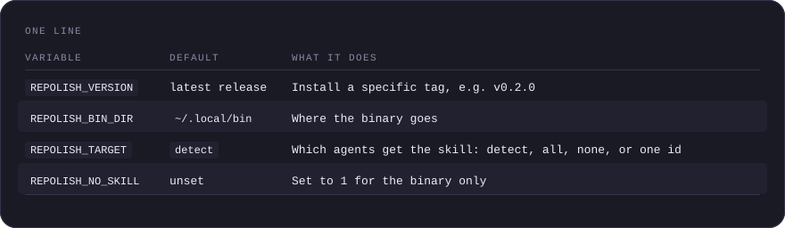
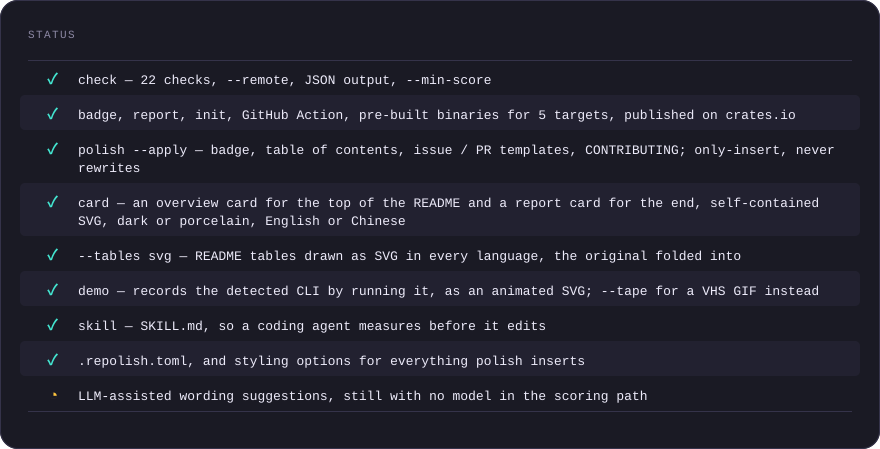

<p align="center">
  
</p>

# repolish

**Score and improve what an open-source repository looks like to a first-time visitor — from the command line.**

[](https://crates.io/crates/repolish)
[](https://github.com/asale-ai/repolish)
[](https://github.com/asale-ai/repolish/actions/workflows/ci.yml)
[](#license)
[](docs/README.md)

[English](README.md) · [中文](README.zh-CN.md)


<sup>The overview card above is written by `repolish card .` and committed by CI on every
push — a plain file in this repository, no fonts, no scripts, nothing hosted by us. Our
score for this repository is at the [bottom of the page](#polished-with-repolish), where
it belongs.</sup>

## Contents

- [Why](#why)
- [Install](#install)
- [Quick start](#quick-start)
- [Usage](#usage)
- [The cards, the tables and the recording](#the-cards-the-tables-and-the-recording)
- [For coding agents](#for-coding-agents)
- [What it checks](#what-it-checks)
- [How scoring works](#how-scoring-works)
- [Status](#status)
- [Development](#development)
- [Contributing](#contributing)
- [License](#license)

## Why

Two kinds of tools already exist: generators that write your README with an LLM, and
linters that check whether a section is present. Neither answers the question an author
actually has — *what is wrong with my repository right now, and what do I change first?*

repolish reads a repository the way a stranger does, scores 22 concrete signals, and for
every point it deducts it names the file and line and tells you what to write instead.

Two rules keep the number worth trusting. **No model in the scoring path** — the same
commit always produces the same score; an LLM can suggest wording, but never moves a
number. And **it says when it does not know** — a check that cannot be decided returns
*inconclusive* and is excluded rather than guessed at, and every excluded check is named.

## Install

### One line

```bash
curl -fsSL https://raw.githubusercontent.com/asale-ai/repolish/main/install.sh | sh
```

Downloads the release binary for your platform, verifies its `.sha256`, installs
it into `~/.local/bin`, and drops the [agent skill](#for-coding-agents) into
whichever agents it finds on the machine. Read it first if you would rather not
pipe a script into a shell — it is POSIX `sh`, about 200 lines, and it does
exactly those four things.



<details>
<summary>One line as a table</summary>

| Variable | Default | What it does |
|---|---|---|
| `REPOLISH_VERSION` | latest release | Install a specific tag, e.g. `v0.2.0` |
| `REPOLISH_BIN_DIR` | `~/.local/bin` | Where the binary goes |
| `REPOLISH_TARGET` | `detect` | Which agents get the skill: `detect`, `all`, `none`, or one id |
| `REPOLISH_NO_SKILL` | unset | Set to `1` for the binary only |

</details>

The Linux builds are glibc-only. On musl (Alpine) the installer says so and
stops rather than installing a binary that cannot run; use `cargo install
repolish` there.

### Pre-built binary

Every release ships binaries for five targets, each with a `.sha256` beside it:
`x86_64-unknown-linux-gnu`, `aarch64-unknown-linux-gnu`, `x86_64-apple-darwin`,
`aarch64-apple-darwin`, `x86_64-pc-windows-msvc`.

```bash
VERSION=0.3.0
TARGET=x86_64-unknown-linux-gnu
curl -fsSL "https://github.com/asale-ai/repolish/releases/download/v${VERSION}/repolish-v${VERSION}-${TARGET}.tar.gz" | tar -xz
sudo install "repolish-v${VERSION}-${TARGET}/repolish" /usr/local/bin/
```

Windows archives are `.zip` and contain `repolish.exe`. Browse every asset on the
[releases page](https://github.com/asale-ai/repolish/releases).

### With cargo

Requires Rust 1.88 or newer.

```bash
cargo install repolish
```

To build the unreleased `main` instead:

```bash
cargo install --git https://github.com/asale-ai/repolish repolish
```

### In GitHub Actions

```yaml
- uses: actions/checkout@v4
  with:
    fetch-depth: 0
- uses: asale-ai/repolish@v0.3.0
  env:
    GITHUB_TOKEN: ${{ secrets.GITHUB_TOKEN }}
```

`repolish init` writes a complete workflow for you, pinned to the version that generated
it. More examples in [action/README.md](action/README.md).

## Quick start

```bash
repolish check .
```

That is the whole thing. Here it is against `demo/sample`, a repository written badly on
purpose — check it, fix what can be fixed, check it again:


<sup>Recorded by repolish itself — see [Recording a CLI](#recording-a-cli). The two
scores in it are whatever that run actually produced; a tool whose job is checking that a
README's promises are true has no business faking its own demo. It is re-recorded by hand
rather than on every push, for a reason worth reading:
[demo/README.md](demo/README.md).</sup>

<details>
<summary>The first of those three commands, as text</summary>

```text
  acme/taskvault  · cli (detected) · local · 52d9d0e4

  SCORE   23 / 100    poor        ▄▄▄▄▄▁▁▁▁▁▁▁▁▁▁▁▁▁▁▁▁▁▁▁

  DISCOVERABILITY    ▄▄▄▄▄▄▁▁▁▁▁▁   56
  COMPREHENSIBILITY  ▄▄▄▁▁▁▁▁▁▁▁▁   28
  CREDIBILITY        ▄▁▁▁▁▁▁▁▁▁▁▁   13

  CHECKS  ●○○○●●●○○●●●●●●●●●●●●●   17 scored · 5 not verified

  ── TO FIX ──────────────────────────────────────────────────────────────

   P1  claim-consistency
       1 of the 1 verifiable command claims in the README no longer work.
       Typing the first command from a README and getting an error is the
       fastest way to lose a user
       └ README.md:8  `scripts/setup.sh` — does not exist in the repository

   P1  license
       Add a LICENSE file. No license means all rights reserved — legally,
       nobody may use your code
       └ .  no LICENSE file in the repository root
```

</details>

Three things there are the point of the tool: **`README.md:8`** — every deduction names a
file and, where there is one, a line; **`5 not verified`** — checks it could not decide are
counted separately and never folded into the score as if they had passed; and **`local`** —
the report always says which baseline produced it, because a local score and a `--remote`
one are not comparable. Run `repolish check . -v` for the full finding list.

## Usage

```bash
repolish check .                    # local checks only, no network
repolish check . --remote           # also read description / topics / homepage from GitHub
repolish check . --format json      # machine-readable, schema frozen at version 1
repolish check . --min-score 70     # exit 1 when below the threshold
repolish check . --only license,ci-present
```

`--remote` reads `GITHUB_TOKEN` or `GH_TOKEN` from the environment. Without a token it
falls back to the anonymous quota of 60 requests per hour.

### Scanning a whole organisation

`check` answers "what is wrong with this repository". `scan` answers a different
question: **across all my repositories, which one do I fix first, and which single fix
lifts the most of them.**

```bash
./scripts/clone-org.sh asale-ai        # git clones them side by side
repolish scan target/orgs/asale-ai --remote
```

```text
  SCORE  REPOSITORY         DISC COMP CRED  FIRST THING TO FIX
  ────────────────────────────────────────────────────────────────────────
    65   agent-firewall       92   55   57   P1 readme-quickstart
    75   token-meter          73   81   71   P2 repo-topics
    85   anything-to-skill    78   90   85   P2 repo-topics
    86   llm-verify           73   96   85   P2 issue-pr-template
    91   asale                78   96   96   P2 readme-title-tagline
    92   seo-geo-skill        87   86  100   P2 repo-topics
    98   repolish             95   99  100   P2 repo-topics

  7 repositories · median 86 · 2 below 80 · 2 P1 in total

  ── FIX ONCE, LIFTS SEVERAL ─────────────────────────────────────────────

     P2 repo-topics                   5 of 7 repositories
     P2 issue-pr-template             4 of 7 repositories
     P2 ci-present                    2 of 7 repositories
```

Worst-first, because whoever reads this table is looking for work, not for a prize. The
last section is the whole reason `scan` exists rather than running `check` N times:
`issue-pr-template` missing in 4 of 7 repositories is one file written once for four
repositories' worth of score.

`scan` does not clone — that would make this binary need the network and git, and scoring
is offline-first. Under `--remote`, one repository failing to fetch fails the whole scan
(exit code 4) rather than quietly mixing a local score into the table. See
[docs/02-CLI设计.md](docs/02-CLI设计.md#scan) for how the shared-gaps section is grouped.

### Styling what it inserts

Everything `polish` inserts is configurable, from the command line or from `[readme]` in
`.repolish.toml`:

```bash
repolish polish . --badge-style for-the-badge --toc-style fold --align center
repolish polish . --logo assets/hero.svg --logo-width full --tree-depth 2
repolish polish . --visuals         # --overview --footer-card --tables svg
```

`--logo-width` takes a pixel count or **`full`**, which emits `width="100%"` — a banner
pinned to a fixed width huddles in the corner of a wide window and overflows a narrow one.
Left unset, `--badge-style` follows whatever badges the README already uses: one badge in a
different style from the rest of the row looks worse than a row that is uniformly not our
default. Full list of options in [docs/02-CLI设计.md](docs/02-CLI设计.md).

**None of this moves a score.** The check list and weights are frozen at v1; a repository
cannot make itself look better by picking a different badge style, because then scores
would stop being comparable — which is the whole point.

The logo, the tree and the cards are **not driven by a check**. Nothing asks for a banner.
They stay off unless you ask, and `polish` says "requested by configuration" in its dry run
rather than dressing them up as fixes.

### Fixing what can be fixed

```bash
repolish polish .                   # print the changes it would make
repolish polish . --apply           # write them
```

`polish` only makes changes that follow mechanically from the findings: the repolish badge
(alongside the `.repolish/badge.json` it points at), a table of contents built from your
own headings, GitHub issue and pull request templates, and a `CONTRIBUTING.md` whose build
and test commands come from your **detected package manifest**.

**Where it cannot know, it does not write.** No manifest means no `CONTRIBUTING.md`,
because the alternative is `<your build command here>` — a file that turns the check green
while the problem stays exactly where it was.

**It only inserts.** The diff is new lines and nothing else: your tabs, list markers,
reference-style link definitions and line endings survive byte for byte. Round-tripping a
README through a Markdown formatter is lossy on 12 of 12 real-world READMEs, and a tool
that teaches people to tidy their repository has no business reflowing their prose.

`--apply` refuses to run outside a git repository unless you pass `--force`, because
`git checkout` is the undo button.

### As a CI gate

On GitHub, the action takes the threshold directly:

```yaml
- uses: asale-ai/repolish@v0.3.0
  with:
    min-score: 70
  env:
    GITHUB_TOKEN: ${{ secrets.GITHUB_TOKEN }}
```

Anywhere else, the exit code is the gate:

```bash
repolish check . --remote --min-score 70
```

Exit code 1 means the score was too low. Exit code 4 means the GitHub call failed —
deliberately different, so a rate limit never reads as a quality regression.

### Exit codes

Tool failure and "checks did not pass" are deliberately different codes, so CI can tell
them apart.


<details>
<summary>Exit codes as a table</summary>

| Code | Meaning |
|---|---|
| 0 | Success |
| 1 | Score below `--min-score` |
| 2 | Bad arguments |
| 3 | Not a valid repository |
| 4 | `--remote` failed (API error, rate limit, private repo) |
| 5 | Fewer than half the checks could run — no total score is reported |

</details>

## The cards, the tables and the recording

Everything repolish draws is a **self-contained, deterministic SVG**: no external fonts,
no scripts, nothing hosted by us, and the same commit renders a byte-identical file. All
of it is a plain file in **your** repository.

```bash
repolish card .                 # .repolish/overview.svg — what this project is
repolish card . --kind score    # .repolish/card.svg     — what repolish scored it
repolish card . --kind tables   # redraw the README's tables
repolish demo .                 # run the CLI and record it as an animated SVG
repolish polish . --apply --visuals   # insert all of the above into the README
```

**Where each one goes is the point.** The overview card belongs at the top, under the
badges: a stranger's first question is what this is, what it is written in, and whether
it is still alive. The report card belongs at the [end](#polished-with-repolish) — at the
top it would mean the first thing a visitor sees is our tool grading your project instead
of your project. Earlier versions of this README had it the other way round, and it was
wrong.

**Tables become pictures, and the original is kept.** GitHub renders Markdown tables;
crates.io, npm and most aggregators print the pipes. `--tables svg` draws each table once
and folds the original into `<details>` beneath it — an image has no text layer, so screen
readers, `grep` and the next person to edit that table all read the folded copy. The
wrapping is pure insertion: the table's own bytes are untouched.

**The recording runs the commands.** `repolish demo` executes them and renders the result
as an animated SVG driven by CSS keyframes — text, so it diffs; no `ttyd`, no `ffmpeg`, no
GIF blobs in the history. The scores in the recording at the top of this page are what that
run actually produced. Use `--dry-run` to see the commands first, and `--tape` if you would
rather have a VHS tape for a registry that does not render SVG.

Two adjustments, neither of which moves a score:

```bash
repolish card . --theme porcelain   # light palette, for a light-leaning README
repolish card . --lang zh-CN        # by default the card follows your README's language
```

`--lang` defaults to **auto** and reads your README, not your shell's locale — a card
saying `LANGUAGES · BY FILE` on top of a Chinese README is our language pushed into
someone else's front door.

The reasoning behind all of it — why no `prefers-color-scheme`, why frame zero of the
recording is the finished state, why the tables are named by slug rather than by index —
is in [docs/02-CLI设计.md](docs/02-CLI设计.md).

## For coding agents

Ask an agent to "improve this README" and its first move is to rewrite the whole file.
That replaces the author's voice, layout and examples with something that reads like every
other README, and it is exactly the failure this tool exists to prevent.

```bash
repolish skill --list             # which agents are installed here
repolish skill --target detect    # install into the ones that are
repolish skill .                  # or write SKILL.md into a repository
```

[skills/repolish/SKILL.md](skills/repolish/SKILL.md) is the file to hand to Claude Code,
Codex, Gemini, OpenCode or anything reading `AGENTS.md`. Beyond the command surface it
carries the part that matters: the order — **measure, apply what is mechanical, hand back
what needs judgement, measure again** — where repolish's own confidence runs out, and what
a good fix looks like per finding. A `claim-consistency` failure is fixed by making the
claim true, **never** by deleting the line, which turns the check green and leaves the
reader with nothing.

That division is the answer to "why not put an LLM in it": the agent has context repolish
structurally cannot have, and repolish has determinism the agent cannot have. A badge whose
number moves because a model answered differently this morning is worth nothing.

## What it checks

22 checks in three categories. Full definitions, weights and thresholds are in
[docs/03-评分维度.md](docs/03-评分维度.md).


<details>
<summary>What it checks as a table</summary>

| Category | Checks |
|---|---|
| **Discoverability** | README title and tagline, repository description, topics, homepage, badges |
| **Comprehensibility** | quickstart, usage example, install-command consistency, link health, length, docs presence, table of contents, translations |
| **Credibility** | license, **claim consistency**, CI, tests, activity, contributing guide, issue and PR templates, release hygiene, code of conduct |

</details>

**Claim consistency** is the one no other tool does: it verifies that the commands your
README promises actually exist. `npm run build` must be in `package.json`, `make test`
must be a real target, `./scripts/setup.sh` must be a real file. A README that fails on
its first command is where readers leave.

## How scoring works

Each check returns 0–10 and carries a risk weight (critical 10, high 7.5, medium 5,
low 2.5). The total is the weighted average, scaled to 100.

A check can also end up *not applicable* (a documentation site needs no test suite),
*inconclusive* (a shallow clone has no tags to judge releases by), or *skipped*. Only
scored checks count toward the denominator, and **if fewer than half the registered
weights were actually scored, no total is reported at all** — otherwise "we checked
three things and they passed" would read as 100/100.

Local and remote scores are not comparable: without `--remote`, three discoverability
checks drop out of the denominator. Reports label which one you are looking at.

## Status

Everything below is either shipped or explicitly not built yet. This section will keep
saying so until it changes:



<details>
<summary>Status as a table</summary>

| | |
|---|---|
| ✅ | `check` — 22 checks, `--remote`, JSON output, `--min-score` |
| ✅ | `badge`, `report`, `init`, GitHub Action, pre-built binaries for 5 targets, published on crates.io |
| ✅ | `polish --apply` — badge, table of contents, issue / PR templates, CONTRIBUTING; only-insert, never rewrites |
| ✅ | `card` — an overview card for the top of the README and a report card for the end, self-contained SVG, dark or porcelain, English or Chinese |
| ✅ | `--tables svg` — README tables drawn as SVG, the original folded into `<details>` |
| ✅ | `scan` — rank every repository in a directory, and surface the gaps they share |
| ✅ | `demo` — records the detected CLI by running it, as an animated SVG; `--tape` for a VHS GIF instead |
| ✅ | `skill` — `SKILL.md`, so a coding agent measures before it edits |
| ✅ | `.repolish.toml`, and styling options for everything `polish` inserts |
| ⏳ | LLM-assisted wording suggestions, still with no model in the scoring path |

</details>

The check set and the JSON schema are frozen for v1: adding, removing, or reweighting a
check changes what a score means everywhere, so it is a versioned decision rather than
ordinary work.

## Development

```bash
git clone https://github.com/asale-ai/repolish
cd repolish
cargo test
cargo clippy --all-targets
cargo fmt --all -- --check
./scripts/fetch-fixtures.sh
```

`fetch-fixtures.sh` clones the 12 real repositories used for manual acceptance. Each entry
is annotated with the defect that repository originally exposed.

Design documents live in [docs/](docs/README.md) and are written in Chinese. The release
runbook — what `./publish.sh` does and why it refuses to start in some states — is in
[CONTRIBUTING.md](CONTRIBUTING.md#releasing).

## Contributing

Issues and pull requests are welcome — see [CONTRIBUTING.md](CONTRIBUTING.md). By
participating you agree to the [Code of Conduct](CODE_OF_CONDUCT.md).

## License

Licensed under either of [Apache License 2.0](LICENSE-APACHE) or
[MIT License](LICENSE-MIT) at your option.

## Polished with repolish


This card is generated by [repolish](https://github.com/asale-ai/repolish) and is a plain file in this repository — no external fonts, no scripts, nothing hosted by a third party. To score your own: `cargo install repolish && repolish check .`.

