<p align="center">
  
</p>

# repolish

**Score and improve what an open-source repository looks like to a first-time visitor — from the command line.**

[](https://crates.io/crates/repolish)
[](https://github.com/asale-ai/repolish)
[](https://github.com/asale-ai/repolish/actions/workflows/ci.yml)
[](#license)
[](docs/README.md)

[English](README.md) · [中文](README.zh-CN.md)


repolish reads a repository the way a stranger does, scores 22 concrete signals, and for
every point it deducts it names the file, the line, and what to write instead. Then it
fixes what can be fixed mechanically.

Two rules keep the number worth trusting. **No model in the scoring path**, so the same
commit always produces the same score. And **it says when it does not know**: an
undecidable check is reported as *not verified* and excluded, never guessed at.

## Contents

- [Start here: install the skill](#start-here-install-the-skill) — for Claude Code, Codex, Cursor and 70+ others
- [Install the CLI](#install-the-cli)
- [The one command](#the-one-command)
- [What it does](#what-it-does) — the five stages
- [Themes](#themes) — fourteen palettes for the cards
- [Controlling it](#controlling-it)
- [Configuration](#configuration)
- [In CI](#in-ci)
- [Cards and recordings](#cards-and-recordings)
- [What it checks](#what-it-checks)
- [How scoring works](#how-scoring-works)
- [Exit codes](#exit-codes)
- [Status](#status)
- [Contributing](#contributing)
- [License](#license)

## Start here: install the skill

Ask a coding agent to "improve this README" and its first move is to rewrite the whole
file, replacing your voice and your examples with something that reads like every other
README. That is the failure this tool exists to prevent — so the thing to install first is
not the binary, it is the **skill** that teaches your agent to measure before it edits.

```bash
npx skills add asale-ai/repolish
```

One command, covering **Claude Code, Codex, Cursor, OpenCode, Gemini CLI and 70+ other
agents**: it detects which are on your machine and asks where to put the skill. Add `-g`
for every project, `-a claude-code` to pick one, `-y` to skip the prompts.

Then ask for what you want, in your own words:

> Use repolish on this repository: score it, show me everything it would change, and
> apply what is mechanical. Leave the tagline and the quick start to me.

The agent runs the CLI itself — through `npx`, nothing else to install — reads the
findings, shows you the plan, and writes only once you have seen it. Also worth asking for:

> Which three repolish findings are worth fixing first?

> Fix only the `claim-consistency` findings — commands my README promises that no longer exist.

> Record a terminal demo of this CLI and put it in the README.

> What did my PR do to the score, against `origin/main`?

[skills/repolish/SKILL.md](skills/repolish/SKILL.md) is the file that gets installed. Past
the command surface it carries the order — **measure, apply what is mechanical, hand back
what needs judgement, measure again**.

<details>
<summary>Installing the skill without the <code>skills</code> CLI</summary>

repolish installs it on its own, and `install.sh` does it as part of the CLI install:

```bash
npx @asale/repolish --list                                   # which agents are installed here
npx @asale/repolish --stages skill --target detect --apply   # install into the ones that are
npx @asale/repolish --stages skill --apply                   # or write SKILL.md into a repository
```

Targets: `claude`, `codex`, `gemini`, `opencode`, and `agents` for anything reading
`AGENTS.md`. `--target all` writes to every one.

</details>

## Install the CLI

```bash
npx @asale/repolish
```

Nothing to install, and it works wherever Node does. The package is a launcher: it
downloads the release binary for your platform, verifies its `.sha256`, and runs it.

<details>
<summary>The other four ways</summary>

**Globally with npm**, for `repolish` on PATH:

```bash
npm install -g @asale/repolish
```

**One line**, which also drops the [agent skill](#start-here-install-the-skill) into whichever agents
it finds on the machine:

```bash
curl -fsSL https://raw.githubusercontent.com/asale-ai/repolish/main/install.sh | sh
```

Same download and `.sha256` check, into `~/.local/bin`. POSIX `sh`, about 200 lines — read
it first if you would rather not pipe a script into a shell.

**With cargo**, needing Rust 1.88 or newer:

```bash
cargo install repolish
cargo install --git https://github.com/asale-ai/repolish repolish  # unreleased main
```

**The archives**, five targets each with a `.sha256`, are on the
[releases page](https://github.com/asale-ai/repolish/releases).

</details>

Linux builds are glibc-only. On musl the installers stop rather than leave a binary that
cannot run; use `cargo install repolish` there.

**Every command below uses `npx @asale/repolish`**, which needs nothing installed — note
that npx does not put `repolish` on your PATH. If you installed it globally, drop the
prefix; the arguments are identical.

## The one command

```bash
npx @asale/repolish
```

**There are no subcommands, and nothing is written.** It scores the repository, then
reports every file it would create or change:


<sup>Recorded by repolish itself against [demo/sample](demo/sample), a repository written
badly on purpose; both scores in it are whatever that run actually produced.
[demo/README.md](demo/README.md).</sup>

<details>
<summary>What a run looks like, as text</summary>

```text
  acme/taskvault  · cli (detected) · local · 52d9d0e4

  SCORE   23 / 100    poor        ▄▄▄▄▄▁▁▁▁▁▁▁▁▁▁▁▁▁▁▁▁▁▁▁

  DISCOVERABILITY    ▄▄▄▄▄▄▁▁▁▁▁▁   56
  COMPREHENSIBILITY  ▄▄▄▁▁▁▁▁▁▁▁▁   28
  CREDIBILITY        ▄▁▁▁▁▁▁▁▁▁▁▁   13

  CHECKS  ●○○○●●●○○●●●●●●●●●●●●●   17 scored · 5 not verified

  ── TO FIX ──────────────────────────────────────────────────────────────

   P1  license
       Add a LICENSE file. No license means all rights reserved — legally,
       nobody may use your code
       └ .  no LICENSE file in the repository root

  WOULD WRITE (6 files)
    .github/ISSUE_TEMPLATE/bug_report.yml       new file
    .github/pull_request_template.md            new file
    CONTRIBUTING.md                             new file
    .repolish/badge.json                        score badge
    .github/workflows/repolish.yml              CI workflow

  Nothing was written. Apply with: npx @asale/repolish --apply
```

</details>

Three things there are the point of the tool. **`README.md:8`** — every deduction names a
file and, where there is one, a line. **`5 not verified`** — checks it could not decide are
never folded into the score as if they had passed. And **`local`** — a local score and a
`--remote` one are not comparable, so the report says which it is.

When the plan looks right:

```bash
npx @asale/repolish --apply
```

That is the whole workflow. `--apply` edits `README.md` **in place and only by inserting**:
the diff is new lines and nothing else, so your tabs, list markers, reference-style link
definitions and line endings survive byte for byte. It refuses to run outside a git
repository unless you pass `--force`, because `git checkout` is the undo button.

## What it does

Five stages, in order: `polish` may insert a reference to a card, and `artifacts` draws it.

| Stage | What it does |
|---|---|
| `check` | Score the repository and print the report |
| `polish` | The fixes that follow mechanically: the badge, a table of contents built from your own headings, GitHub issue and PR templates, and a `CONTRIBUTING.md` whose commands come from your detected package manifest |
| `artifacts` | Write `.repolish/badge.json`, draw the banner and the two cards, and redraw every SVG the README already references |
| `ci` | Write `.github/workflows/repolish.yml` |
| `demo` | Record the CLI as an animated SVG and reference it from the README and every translation. Prints the command list; **only `--apply` runs them** |

**Where it cannot know, it does not write.** No manifest means no `CONTRIBUTING.md`,
because the alternative is `<your build command here>` — a file that turns the check green
while the problem stays where it was. Existing files are left alone; `--force` regenerates.

One more stage exists but is **not** in the default run: `skill`, which writes `SKILL.md`
or [installs it into your agents](#start-here-install-the-skill). A run that skipped it
says so at the end.

**The GitHub API is called by default when a token is set**, so description, topics and
homepage are checked and the star curve is drawn. Without one it stays local and says so
rather than failing. `--remote` forces it anyway; `--no-remote` never calls.

Anything skipped for want of an input is listed at the end, with the command that fixes it:

```text
  NEEDS INPUT — these were skipped for want of something
    · repository description, topics and homepage were not checked
      set GITHUB_TOKEN or GH_TOKEN (`export GITHUB_TOKEN=$(gh auth token)`), …
    · no terminal recording — no command-line binary was detected here
      name the commands: … --stages demo --cmd "…" --apply
```

## Themes

The card ends up in **your** page, and that page already has a temperature. Fourteen
palettes, each shown here on the card it actually produces — click one for its full page,
hexes and contrast figures. **No palette can move a score**; it picks colours for the same
numbers.

```bash
npx @asale/repolish --apply --theme slate
```

<table>
<tr>
<td width="50%" align="center"><a href="docs/themes/dark/README.md">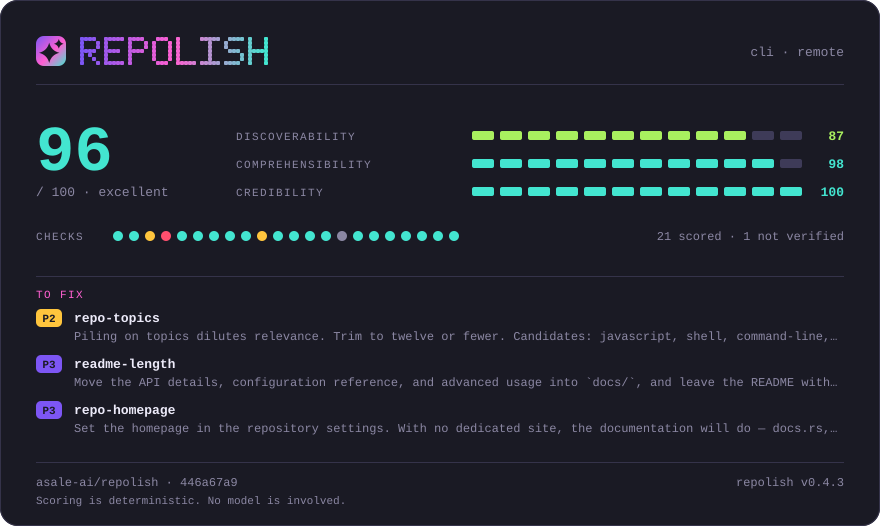</a><br><code>dark</code> · the default</td>
<td width="50%" align="center"><a href="docs/themes/porcelain/README.md">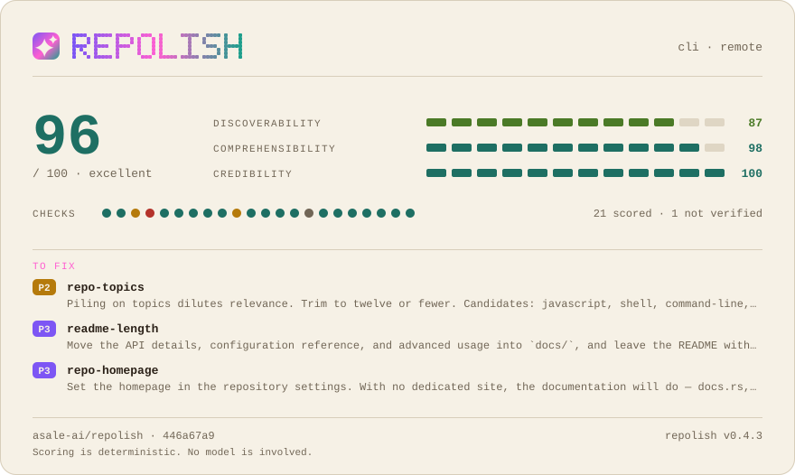</a><br><code>porcelain</code> · warm paper</td>
</tr>
<tr>
<td width="50%" align="center"><a href="docs/themes/slate/README.md"></a><br><code>slate</code> · GitHub blue-grey</td>
<td width="50%" align="center"><a href="docs/themes/nord/README.md"></a><br><code>nord</code> · desaturated</td>
</tr>
<tr>
<td width="50%" align="center"><a href="docs/themes/ember/README.md">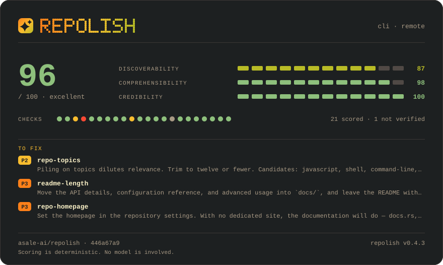</a><br><code>ember</code> · Gruvbox</td>
<td width="50%" align="center"><a href="docs/themes/solar/README.md">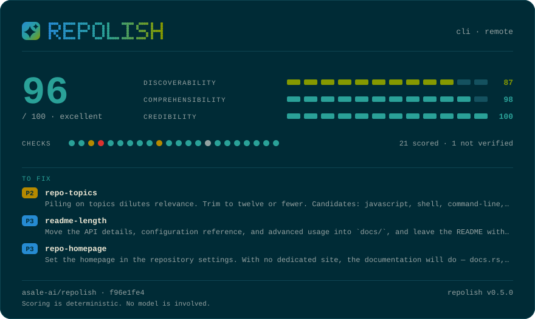</a><br><code>solar</code> · Solarized</td>
</tr>
<tr>
<td width="50%" align="center"><a href="docs/themes/phosphor/README.md">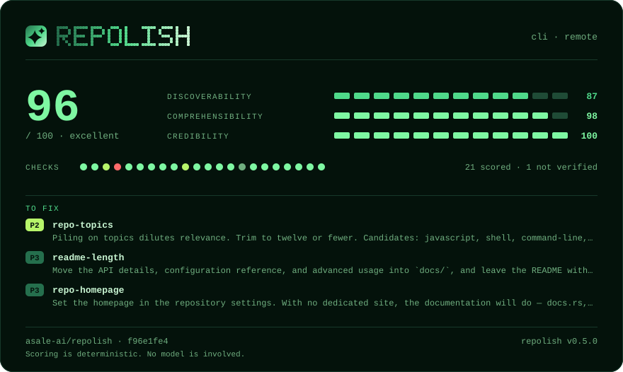</a><br><code>phosphor</code> · single-hue green</td>
<td width="50%" align="center"><a href="docs/themes/blueprint/README.md">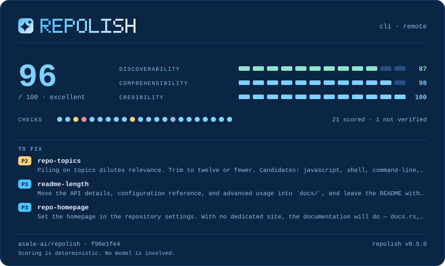</a><br><code>blueprint</code> · drafting blue</td>
</tr>
<tr>
<td width="50%" align="center"><a href="docs/themes/okabe/README.md">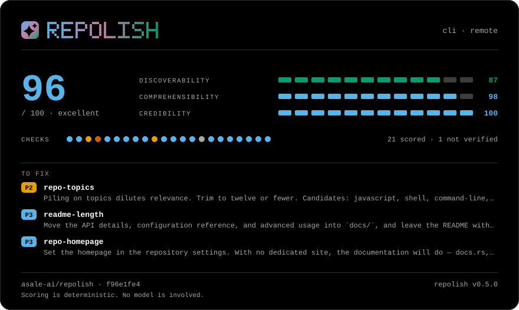</a><br><code>okabe</code> · colour-blind safe</td>
<td width="50%" align="center"><a href="docs/themes/newsprint/README.md">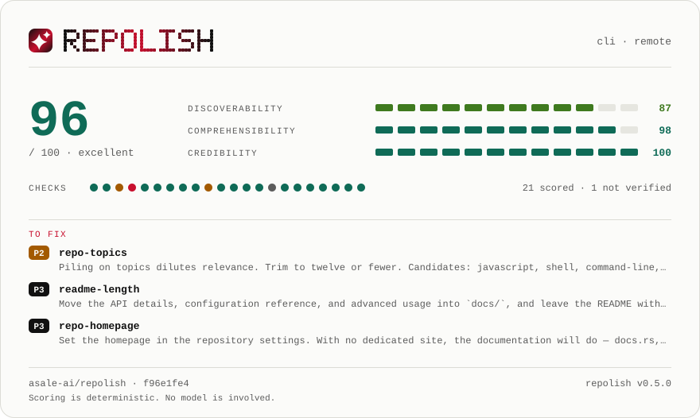</a><br><code>newsprint</code> · greyscale + red</td>
</tr>
<tr>
<td width="50%" align="center"><a href="docs/themes/sakura/README.md">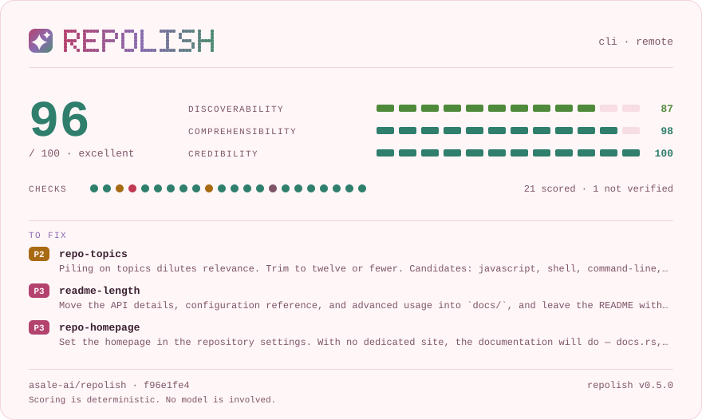</a><br><code>sakura</code> · soft rose</td>
<td width="50%" align="center"><a href="docs/themes/glacier/README.md"></a><br><code>glacier</code> · cold light</td>
</tr>
<tr>
<td width="50%" align="center"><a href="docs/themes/carbon/README.md">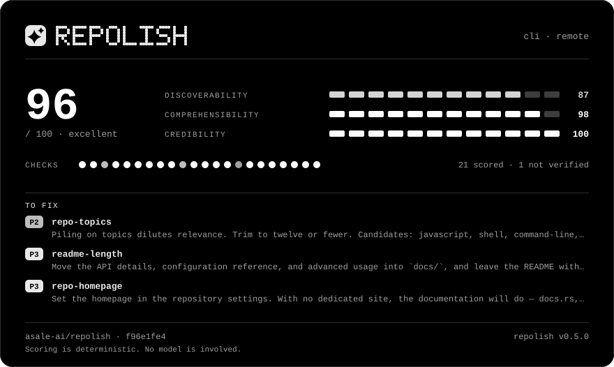</a><br><code>carbon</code> · black and white</td>
<td width="50%" align="center"><a href="docs/themes/paper/README.md">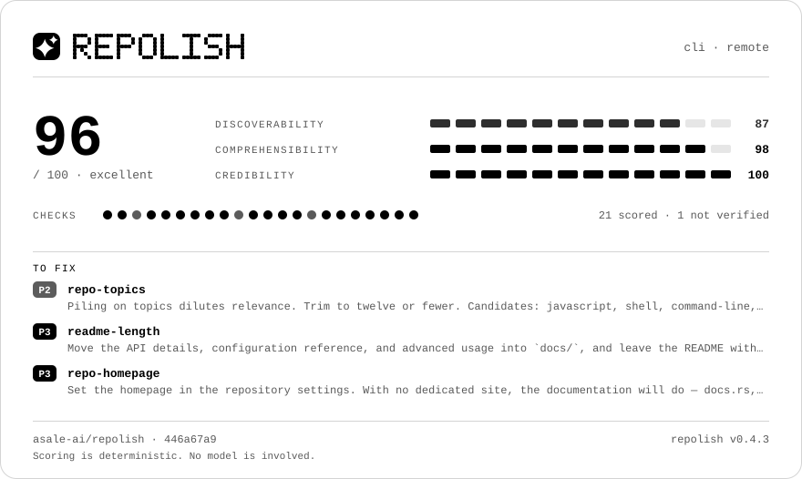</a><br><code>paper</code> · white and black</td>
</tr>
</table>

Two of them answer something narrower than taste: `okabe` stays legible with red-green
colour blindness, and `carbon` / `paper` have no hue and no gradient, so the card is the
same picture once the colour is taken out of it — on a photocopier, on e-ink, in print.
All fourteen: [docs/themes](docs/themes/README.md).

## Controlling it

```bash
npx @asale/repolish --stages check                 # score only, write nothing
npx @asale/repolish --stages check,polish --apply  # fix, but no badge JSON and no CI workflow
npx @asale/repolish --stages demo --apply          # record the animation
npx @asale/repolish -v                             # P3 suggestions, passing checks, full file contents
npx @asale/repolish --remote                       # also read description / topics / homepage from GitHub
```

`--remote` reads `GITHUB_TOKEN` or `GH_TOKEN`; without one the anonymous quota is 60 an hour.

```bash
npx @asale/repolish --format json              # schema frozen at version 1
npx @asale/repolish --only license,ci-present  # run just these checks
npx @asale/repolish --skip repo-topics         # run everything except this
```

`--format` accepts `text` (the default), `json`, `markdown`, `sarif` and `comment`. In
every format but `text`, **stdout carries only the report** and everything procedural goes
to stderr, so `… --format json | jq` works on a full run.

Three findings are deliberately left for you: the tagline, the quick start and the usage
example. No mechanical rule can satisfy them — and if you [installed the
skill](#start-here-install-the-skill), your agent is already the right thing to ask. For
the CLI on its own, a model can draft those three and only those three:

```bash
npx @asale/repolish --suggest  # needs REPOLISH_LLM_API_KEY, or ANTHROPIC_API_KEY
```

It **never writes**, not even with `--apply`, and does not move a score.
[Why those three](docs/04-usage.md).

## Configuration

Anything you would otherwise repeat goes in `.repolish.toml` at the repository root. The
command line always wins, and an unknown key is an error, not a silent no-op.

```toml
profile   = "cli"      # override the detected project type
min_score = 70         # same as --min-score

[checks]
skip = ["repo-topics"]

[readme]               # how the insertions look. None of this moves a score.
toc-style = "fold"
theme     = "porcelain"

[suggest]              # which model drafts the suggestions. No API key here: this file is committed.
model = "claude-sonnet-4-5"
```

Per-check thresholds are deliberately not configurable: letting every repository tune its
own would make scores incomparable, which is the reason this tool exists.
[The full key list](docs/04-usage.md).

## In CI

The `ci` stage writes a workflow with two jobs: one on pushes that records the score and
commits the badge, one on pull requests that reports **what the change did** to the score,
uploads SARIF so each finding lands on its own line in the diff, and comments.

```bash
npx @asale/repolish --stages ci --min-score 70 --apply
```

To wire it up by hand:

```yaml
- uses: asale-ai/repolish@v0.4.3
  with:
    min-score: 70
  env:
    GITHUB_TOKEN: ${{ secrets.GITHUB_TOKEN }}
```

Anywhere else the exit code is the gate. Exit 1 means the score was too low; exit 4 means
the GitHub call failed — deliberately different, so a rate limit never reads as a
regression. On a pull request the *change* is the story:

```bash
npx @asale/repolish --stages check --base origin/main      # report the difference against a ref
npx @asale/repolish --stages check --sarif repolish.sarif  # one annotation per finding, on its line
npx @asale/repolish --stages check --comment comment.md    # the short form, for a PR comment
```

`--sarif` and `--comment` write even without `--apply`: you named the path, so that is the
request, not a change to your repository.


[How each behaves](docs/04-usage.md) · [the Action's inputs](action/README.md)

## Cards and recordings

```bash
npx @asale/repolish --apply                     # cards and SVG tables are included
npx @asale/repolish --apply --no-visuals        # leave the README's visuals alone
npx @asale/repolish --stages artifacts --apply  # redraw everything already referenced
npx @asale/repolish --stages demo --apply       # record the CLI as an animated SVG
```

Everything repolish draws is a **self-contained, deterministic SVG**, and a plain file in
**your** repository — so it cannot go 404 on you, rate-limit you, or log who read your
README. The overview card belongs at the top, under the badges; the report card belongs at
the [end](#polished-with-repolish), because at the top a visitor would meet our tool
grading your project before meeting your project.

`polish` inserts each reference once; `artifacts` redraws the file every run after that, so
the image never goes stale. Pick a single one with
`--artifact badge,report,hero,overview,score,tables`.

The rest — `--theme` (the [fourteen palettes](#themes)), `--lang`, `--stars`, why `demo`
really runs the commands it records — is in
[docs/02-cli-design.md](docs/02-cli-design.md).

## What it checks

22 checks in three categories. Three need the GitHub API. Full definitions and weights:
[docs/03-scoring.md](docs/03-scoring.md).


<details>
<summary>What it checks as a table</summary>

| Category | Checks |
|---|---|
| **Discoverability** | README title and tagline, repository description, topics, homepage, badges |
| **Comprehensibility** | quickstart, usage example, install-command consistency, link health, length, docs presence, table of contents, translations |
| **Credibility** | license, **claim consistency**, CI, tests, activity, contributing guide, issue and PR templates, release hygiene, code of conduct |

</details>

**Claim consistency** is the one no other tool does: `npm run build` must be in
`package.json`, `make test` must be a real target. A README that fails on its first command
is where readers leave.

## How scoring works

Each check returns 0–10 and carries a risk weight; the total is the weighted average.
Checks that end up *not applicable*, *inconclusive* or *skipped* are excluded from the
denominator rather than counted as passes — and **if less than half the total weight could
be scored, no total is reported at all**, because "we checked three things and they passed"
must not read as 100/100. [docs/03-scoring.md](docs/03-scoring.md).

## Exit codes

Tool failure and "checks did not pass" are deliberately different codes.


<details>
<summary>Exit codes as a table</summary>

| Code | Meaning |
|---|---|
| 0 | Success |
| 1 | Score below `--min-score` |
| 2 | Bad arguments |
| 3 | Not a valid repository |
| 4 | `--remote` failed (API error, rate limit, private repo) |
| 5 | Less than half the total weight could be scored — no total score is reported |
| 7 | `--base` could not be resolved: shallow clone, unknown ref, no git |

</details>

## Status

Everything described above is shipped. The check set and the JSON schema are frozen for
v1: adding, removing or reweighting a check changes what a score means everywhere, so it
is a versioned decision rather than ordinary work.

## Contributing

Issues and pull requests are welcome. [CONTRIBUTING.md](CONTRIBUTING.md) covers building
the project, the three rules that are not up for debate, how to add a check, and the
release runbook. Design notes: [docs/](docs/README.md). By participating you agree to the
[Code of Conduct](CODE_OF_CONDUCT.md).

## License

Licensed under either of [Apache License 2.0](LICENSE-APACHE) or
[MIT License](LICENSE-MIT) at your option.

## Polished with repolish


This card is generated by [repolish](https://github.com/asale-ai/repolish) and is a plain
file in this repository — no external fonts, no scripts, nothing hosted by a third party.
To score your own: `npx skills add asale-ai/repolish`, then ask your agent.
