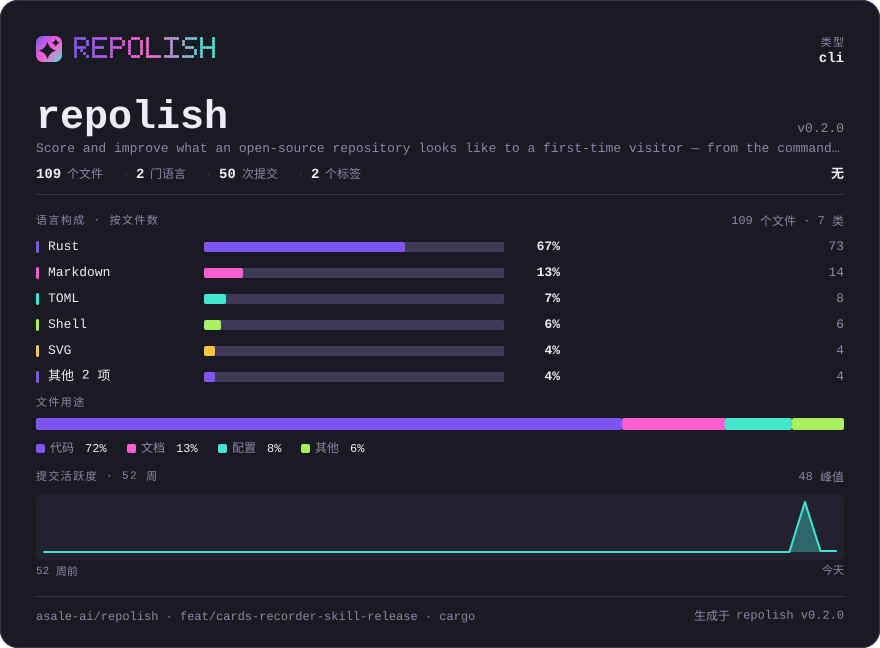
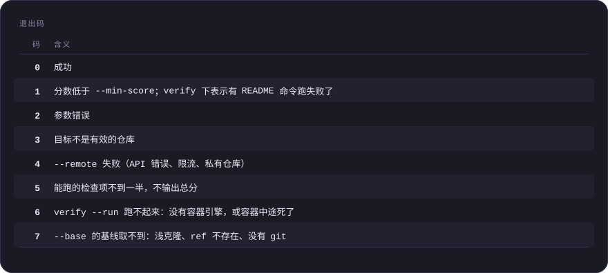
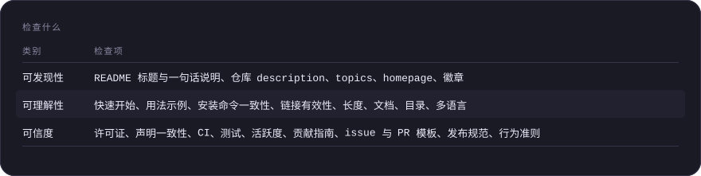
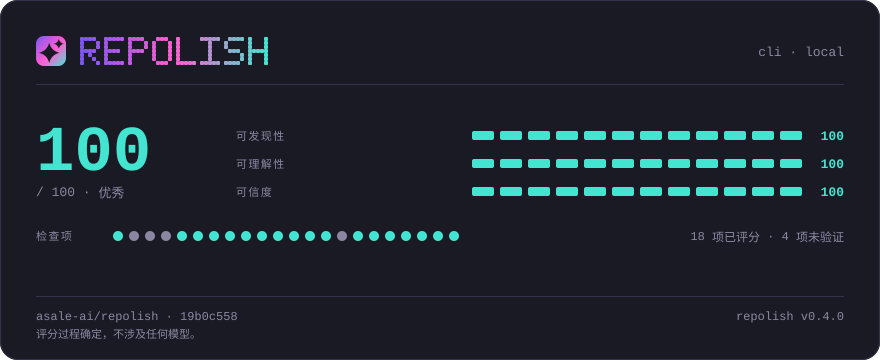

<p align="center">
  
</p>

# repolish

**在命令行上诊断并改进「一个开源仓库在陌生人眼里是什么样」。**

[](https://crates.io/crates/repolish)
[](https://github.com/asale-ai/repolish)
[](https://github.com/asale-ai/repolish/actions/workflows/ci.yml)
[](#许可证)
[](docs/README.md)

[English](README.md) · [中文](README.zh-CN.md)



<sup>上面这张概览卡片由 `repolish card . --lang zh-CN` 生成，每次 push 由 CI 提交。它就是
本仓库里的一个普通文件——没有字体、没有脚本，我们不托管任何东西。我们给这个仓库打的**分数**
在[页面末尾](#用-repolish-打磨)，那才是它该待的地方。</sup>

## 目录

- [为什么做这个](#为什么做这个)
- [安装](#安装)
- [快速开始](#快速开始)
- [用法](#用法)
- [证明 README 说的是真的](#证明-readme-说的是真的)
- [卡片、表格与录屏](#卡片表格与录屏)
- [给编码智能体用](#给编码智能体用)
- [检查什么](#检查什么)
- [分数怎么来的](#分数怎么来的)
- [当前状态](#当前状态)
- [贡献](#贡献)
- [许可证](#许可证)

## 为什么做这个

现有的工具分两类：用 LLM 替你写 README 的生成器，和检查「某个区块在不在」的检查器。
两类都没有回答作者真正的问题——**我的仓库现在到底哪里不行，该先改哪一条？**

repolish 按陌生人的读法过一遍仓库，对 22 个具体信号打分，每扣一分都指出文件和行号，
并告诉你该改成什么。

有两条规则让这个分数值得信：

- **评分路径上没有模型。** 同一个 commit 永远得到同一个分数。LLM 可以在之后润色措辞，
  但它不会改动任何一个数字。
- **判不了就说判不了。** 无法确定的检查项返回「不确定」并被剔出分母，而不是猜一个。
  被剔出去的每一项都会列在报告里。

## 安装

```bash
npx @asale/repolish check .
```

不用装任何东西，有 Node 的地方就能跑。这个包是一层启动器，不是另一份实现：
它下载对应平台的发布二进制、校验 `.sha256`、然后执行——不管走哪条路，
检查本身都是同一个静态 Rust 二进制。

<details>
<summary>另外三种装法</summary>

**一行装好**，它顺带把[智能体技能](#给编码智能体用)放进这台机器上装了的那几家智能体里：

```bash
curl -fsSL https://raw.githubusercontent.com/asale-ai/repolish/main/install.sh | sh
```

它下载二进制、核对 `.sha256`、装进 `~/.local/bin`。POSIX `sh`，两百行左右，就干这四件事——
不想把脚本管道进 shell 的话，先读一遍。`REPOLISH_VERSION`、`REPOLISH_BIN_DIR`、
`REPOLISH_TARGET` 可以覆盖默认值。

**用 cargo**，需要 Rust 1.88 或更新版本：

```bash
cargo install repolish
cargo install --git https://github.com/asale-ai/repolish repolish   # 未发布的 main
```

**归档本身**：五个平台，每个都带 `.sha256`，在[发布页](https://github.com/asale-ai/repolish/releases)。

</details>

Linux 版只有 glibc 构建。在 musl（Alpine）上安装器会直说并停下，而不是留下一个根本跑不起来的
二进制——那种情况请用 `cargo install repolish`。GitHub Action 的用法见
[action/README.md](action/README.md)。

## 快速开始

```bash
repolish check .
```

就这一条。下面是它跑在 `demo/sample` 上的真实录屏——那是一个故意写得很糙的仓库：先 check，再把能改的改掉，然后重新 check。



<sup>由 repolish 自己录的，见[卡片、表格与录屏](#卡片表格与录屏)。里面那两个分数就是那一次真的跑出来的分数——一个专门检查「README 承诺的命令是否真的存在」的工具，自己的演示不能是编的。它是手动重录而不是每次 push 重录，理由值得一读：[demo/README.md](demo/README.md)。</sup>

<details>
<summary>上面三条命令里的第一条，文字版</summary>

```text
  acme/taskvault  · cli (detected) · local · 52d9d0e4

  SCORE   23 / 100    poor        ▄▄▄▄▄▁▁▁▁▁▁▁▁▁▁▁▁▁▁▁▁▁▁▁

  DISCOVERABILITY    ▄▄▄▄▄▄▁▁▁▁▁▁   56
  COMPREHENSIBILITY  ▄▄▄▁▁▁▁▁▁▁▁▁   28
  CREDIBILITY        ▄▁▁▁▁▁▁▁▁▁▁▁   13

  CHECKS  ●○○○●●●○○●●●●●●●●●●●●●   17 scored · 5 not verified

  ── TO FIX ──────────────────────────────────────────────────────────────

   P1  claim-consistency
       1 of the 1 verifiable command claims in the README no longer work.
       Typing the first command from a README and getting an error is the
       fastest way to lose a user
       └ README.md:8  `scripts/setup.sh` — does not exist in the repository

   P1  license
       Add a LICENSE file. No license means all rights reserved — legally,
       nobody may use your code
       └ .  no LICENSE file in the repository root
```

</details>

这段输出里有三处才是这个工具的意义所在：

- **`README.md:8`** —— 每一处扣分都指出文件，有行号的给行号。
- **`5 not verified`** —— 判不了的检查项单独计数并逐条列名，绝不混进分数里当成通过。
- **`local`** —— 报告永远标明这个分数出自哪一种基准，见[分数怎么来的](#分数怎么来的)。

想看横幅、配色和完整的发现列表，跑 `repolish check . -v`。

## 用法

```bash
repolish check .                    # 只做本地检查，不联网
repolish check . --remote           # 额外读取 GitHub 的 description / topics / homepage
repolish check . --format json      # 机器可读，schema 已冻结在版本 1
repolish check . --min-score 70     # 低于阈值时以退出码 1 结束
repolish check . --only license,ci-present
```

`--remote` 从环境变量读取 `GITHUB_TOKEN` 或 `GH_TOKEN`。没有 token 时走匿名配额，
每小时 60 次。

### 插入物的排版

```bash
repolish polish . --badge-style for-the-badge --toc-style fold --align center
repolish polish . --logo assets/hero.zh-CN.svg --logo-width full --tree-depth 2
repolish polish . --visuals         # --overview --footer-card --tables svg
```

也可以写在 `.repolish.toml` 的 `[readme]` 段里，完整清单见 [docs/02-cli-design.zh-CN.md](docs/02-cli-design.zh-CN.md)。**这些都不影响分数**——检查项清单与权重在 v1 冻结，一个仓库不能靠换徽章样式让自己好看一点。logo、目录树和卡片不由任何检查驱动，不显式开就不会有，干跑时也照实写「由配置要求」，而不是把它们打扮成修复。

### 把能改的直接改掉

```bash
repolish polish .                   # 打印它会做的改动，不落盘
repolish polish . --apply           # 真的写
```

`polish` 只做能从发现里机械推出来的改动：repolish 徽章、用你自己的标题生成的目录、GitHub 的 issue 与 PR 模板，以及一份构建和测试命令来自**探测到的包清单**的 `CONTRIBUTING.md`。

**推不出来就不写。** 没有包清单就没有 `CONTRIBUTING.md`——另一条路是写一份 `<your build command here>`，那种文件让检查变绿，问题却原地不动。

**它只增量插入。** 产出的 diff 全是新增行：你的制表符、列表标记、引用式链接定义和行尾逐字节保留。不在 git 仓库里时 `--apply` 会拒绝执行，除非加 `--force`——没有 `git checkout` 就没有撤销键。

### 它替你写不了的那三段

```bash
repolish polish . --suggest         # 需要 REPOLISH_LLM_API_KEY
```

权重最高的三项，恰好是任何机械规则都满足不了的：一句话简介（Critical）、
快速开始（Critical）、用法示例（High）。`--suggest` 起草这三段，且只有这三段。

**「评分路径无模型」是一条关于评分的规矩，它一个字都没改**——生成建议前后跑 `check`，
数字完全一样。当初的错误是把它顺手延伸到了**修复**上：结果 `polish` 忙着插徽章，
而作者卡在标题下面那一句话上。

边界因此画在别处，而且画得更死。它**从不落盘**——连 `--apply` 都不写，它打印，你自己挑着贴。
它**只补缺的那一段**，因为重写别人的 README 正是这个工具存在的理由所要防的失败。
它还**编不出东西**：交给它的是仓库里真实的包清单、可执行文件名和脚本名，
并被要求「缺一个事实就把建议留空并说明，绝不硬编一个」——一条编造的安装命令，
恰恰是 `claim-consistency` 生来要抓的东西。完整理由见
[docs/02-cli-design.md](docs/02-cli-design.md)。

密钥取自 `REPOLISH_LLM_API_KEY` 或 `ANTHROPIC_API_KEY`。repolish 里没有别的地方会跟模型说话。

### 用作 CI 门禁

在 GitHub 上，action 直接收阈值：

```yaml
- uses: asale-ai/repolish@v0.3.0
  with:
    min-score: 70
  env:
    GITHUB_TOKEN: ${{ secrets.GITHUB_TOKEN }}
```

其他地方，退出码就是门禁：

```bash
repolish check . --remote --min-score 70
```

退出码 1 表示分数不达标，4 表示 GitHub 调用失败——两者刻意区分开，
免得一次限流被读成质量退步。

#### 在 PR 上，重点是变化量

一个绝对分数对评审的人没有意义。「这个 PR 让分数掉了 4 分，因为第 42 行的链接失效了」
才告诉他该做什么。

```bash
repolish check . --base origin/main
repolish check . --sarif repolish.sarif    # 每条发现一条注解，落在它自己那一行
repolish check . --comment comment.md      # 短报告，给 PR 评论用
```

`--base` 把基线检出到一个**临时 git 工作树**，用完全相同的一套选项再评一次——
你的工作区一个字节都不会动，本地分也绝不会拿去和远程分相减，报告只列出动过的那几项。

每一条扣分从第一个版本起就带着文件和行号。SARIF 做的事是把它们放进 **diff 里**，
紧挨着代码，而不是留在一段没人展开的 CI 日志里。action 把三者一起接好了：

```yaml
- uses: asale-ai/repolish@v0.3.0
  with:
    min-score: 70
    base: ${{ github.event.pull_request.base.sha }}
    sarif: repolish.sarif
    comment: true
```

评论是**每次推送改写同一条**，不是往下追加——一个每次都新发一条评论的机器人，
第三条之后就会被所有人折叠，连带把真正变红的那一次一起埋掉。
所需权限、SARIF 上传步骤，以及基线所需的 `fetch-depth: 0`，见
[action/README.md](action/README.md)。

### 退出码

工具自身失败与「检查不通过」用的是不同的码，否则 CI 里分辨不出来。



<details>
<summary>退出码（表格原文）</summary>

| 码 | 含义                            |
| - | ----------------------------- |
| 0 | 成功                            |
| 1 | 分数低于 `--min-score`；`verify` 下表示有 README 命令跑失败了 |
| 2 | 参数错误                          |
| 3 | 目标不是有效的仓库                     |
| 4 | `--remote` 失败（API 错误、限流、私有仓库） |
| 5 | 能跑的检查项不到一半，不输出总分              |
| 6 | `verify --run` 跑不起来：没有容器引擎，或容器中途死了 |
| 7 | `--base` 的基线取不到：浅克隆、ref 不存在、没有 git |

</details>

## 证明 README 说的是真的

`claim-consistency` 核对的是 README 承诺的命令**存不存在**。这抓得住改名和删除，
抓不住新用户真正会撞上的那一种——命令还在，但它需要一个没人写下来的系统依赖，
于是在一台不是你的机器上，第一步就炸了。

`verify` 把这个缺口补上：**真的跑一遍**。

```bash
repolish verify .                   # 打印计划，什么都不执行
repolish verify . --run             # 在一个干净的容器里执行
repolish verify . --run --image python:3.12 --section 安装
```

不加 `--run` 时它只打印会执行什么、其余的为什么会被跳过。加了 `--run`
就在**容器里**执行，而且是**同一个 shell 会话**——第二步里的 `cd` 对第三步依然有效，
跟着 README 一路敲下来的读者体验到的正是这样。

三条不让步的规矩。**绝不在你的机器上跑**：这些命令会装东西、改配置，
所以没有容器引擎时它以退出码 6 停下，而不是降级到宿主机。
**仓库是只读挂载**并复制进去的，README 里的任何命令都碰不到你的工作区。
**跳过的每一条都列出来，带理由**——一份写着「12 条通过」而其中 9 条被悄悄跳过的报告，
比没有报告更糟。

它会跳过任何发布的、需要 root 的、不会自己退出的、带着留给读者填的占位符的命令；
完整清单见 [docs/02-cli-design.md](docs/02-cli-design.md)。
镜像跟着包清单选，报告会说清是哪一个、为什么。`--offline` 断网跑。
`--format json` 给出每条命令一条记录。

退出码在 CI 里是重点：**有命令失败是 1**，与「分数低于阈值」同属一类事件；
**压根跑不起来是 6**，那不是质量退步，也绝不该被读成质量退步。

## 卡片、表格与录屏

repolish 画出来的每一张图都是**自包含、确定性的 SVG**：不引外部字体、不引脚本、不由我们托管，同一个 commit 逐字节一致。全部是**你自己仓库里**的普通文件。

```bash
repolish card .                 # .repolish/overview.svg —— 这个项目是什么
repolish card . --kind score    # .repolish/card.svg     —— repolish 给它打了几分
repolish card . --kind tables   # 重画 README 里的表格
repolish demo .                 # 真的跑一遍 CLI，录成会动的 SVG
repolish polish . --apply --visuals   # 把以上全部插进 README

repolish card . --theme porcelain   # 浅色板，给以浅色为主的 README
repolish card . --lang ja           # en / zh-CN / ja；缺省跟着你的 README 走
repolish card . --remote --stars    # 加上 star 增长曲线
```

`--stars` 画的是这个仓库的 star 是怎么涨起来的。GitHub 没有「历年 star 数」这样的接口，所以点取自 stargazer 列表——它按加星时间返回，于是第 *k* 页的第一个人，就是仓库第 *(k-1)×100+1* 颗星落下的那一刻。抽十几页就得到十几个**精确**的点，近似的只有点与点之间那几段直线。代价是十几次额外的 API 请求，所以默认不开。

**它只对你有管理权或协作权的仓库有效。** 2026 年 7 月起 GitHub 把 stargazer 名单限制给了仓库的 admin 与 collaborator，所以拿 `--stars` 去看别人的仓库会取不到，并且会说清原因。这在实际使用中不太算限制——repolish 本来就是给**你自己的**仓库打分的——但值得先知道，免得对着一张没有曲线的卡片发愣。

**哪张放哪儿才是重点。** 概览卡片在顶上、徽章下面：陌生人第一个问题是「这是什么、还活着吗」。分数卡片在[末尾](#用-repolish-打磨)——放顶上意味着访客第一眼看到的是我们的工具在给你的项目评级，而不是你的项目。

`--tables svg` 把每张表画成图，并把原表格折进紧挨着的 `<details>`，仓库里有几种语言的 README 就各做一份。原文一定留着：图片没有文本层，读屏软件、`grep` 和下一个想改这张表的人，读的都是折起来的那份。

`repolish demo` **真的会跑**那些命令再录制——本页顶上那段录屏里的两个分数，就是那一次跑出来的。`--dry-run` 可以先看它要跑什么。

背后的取舍——为什么不做 `prefers-color-scheme`、为什么录屏第 0 帧是终态、为什么表格文件按 slug 而不是序号命名、为什么判语言时假名先于汉字占比——写在 [docs/02-cli-design.zh-CN.md](docs/02-cli-design.zh-CN.md)。

## 给编码智能体用

让一个智能体「把这个 README 改好」，它的第一个动作是把整个文件重写一遍。那会用一份读起来和其他所有 README 一模一样的东西，换掉作者的语气、排版和例子——而那正是这个工具存在的理由所要防的事。

```bash
repolish skill --list             # 这台机器上装了哪几家智能体
repolish skill --target detect    # 装进探测到的那几家
repolish skill .                  # 或者把 SKILL.md 写进一个仓库
```

[skills/repolish/SKILL.md](skills/repolish/SKILL.md) 可以直接交给 Claude Code、Codex、Gemini、OpenCode 或任何读 `AGENTS.md` 的东西。除了命令清单，它还写着那个顺序——**先量，再落实能机械落实的，把需要判断的交回给人，然后再量一次**——repolish 自己的把握到哪里为止，以及每一条发现「好的修法长什么样」。`claim-consistency` 的修法是把那条声明变成真的，**绝不是删掉那一行**——删掉只会让检查变绿，读者手里什么都不剩。

## 检查什么

22 个检查项，分三类。完整定义、权重与阈值见
[docs/03-scoring.zh-CN.md](docs/03-scoring.zh-CN.md)。



<details>
<summary>检查什么（表格原文）</summary>

| 类别       | 检查项                                                  |
| -------- | ---------------------------------------------------- |
| **可发现性** | README 标题与一句话说明、仓库 description、topics、homepage、徽章    |
| **可理解性** | 快速开始、用法示例、安装命令一致性、链接有效性、长度、文档、目录、多语言                 |
| **可信度**  | 许可证、**声明一致性**、CI、测试、活跃度、贡献指南、issue 与 PR 模板、发布规范、行为准则 |

</details>

**声明一致性**是别的工具都没做的一项：它核对 README 里承诺的命令是否真的存在。
`npm run build` 必须在 `package.json` 里，`make test` 必须是真的目标，
`./scripts/setup.sh` 必须是真的文件。README 的第一条命令就跑不通，读者就是在那里离开的。

`repolish verify` 拿同一批命令[真的跑一遍](#证明-readme-说的是真的)。

## 分数怎么来的

每个检查项返回 0–10 分并带一个风险权重，总分是加权平均。判成*不适用*、*无法判定*或*被跳过*的项会被剔出分母，而不是当成通过——并且**当被评分的权重不足一半时，根本不输出总分**，因为「查了三项、三项都过」不能读成 100/100。

权重、阈值与聚合规则见 [docs/03-scoring.zh-CN.md](docs/03-scoring.zh-CN.md)。

## 当前状态

上面写到的都已经实现，`verify` 与 LLM 辅助润色措辞也在内——评分路径上依然没有模型，
那条规矩一个字都没改。

检查项清单与 JSON schema 在 v1 冻结。增删或调整一个检查项的权重，会改变「分数」这个词在所有地方的含义，所以那是一个需要版本号的决定，不是日常改动。

## 贡献

欢迎提 issue 与 PR，见 [CONTRIBUTING.md](CONTRIBUTING.md)。参与即表示你同意遵守
[行为准则](CODE_OF_CONDUCT.md)。

## 许可证

在 [Apache License 2.0](LICENSE-APACHE) 与 [MIT License](LICENSE-MIT) 之间任选其一。

## 用 repolish 打磨



这张卡片由 [repolish](https://github.com/asale-ai/repolish) 生成，是仓库里的一个普通文件——没有外部字体、没有脚本、不由任何第三方托管。想给自己的仓库打一次分：`cargo install repolish && repolish check .`。
