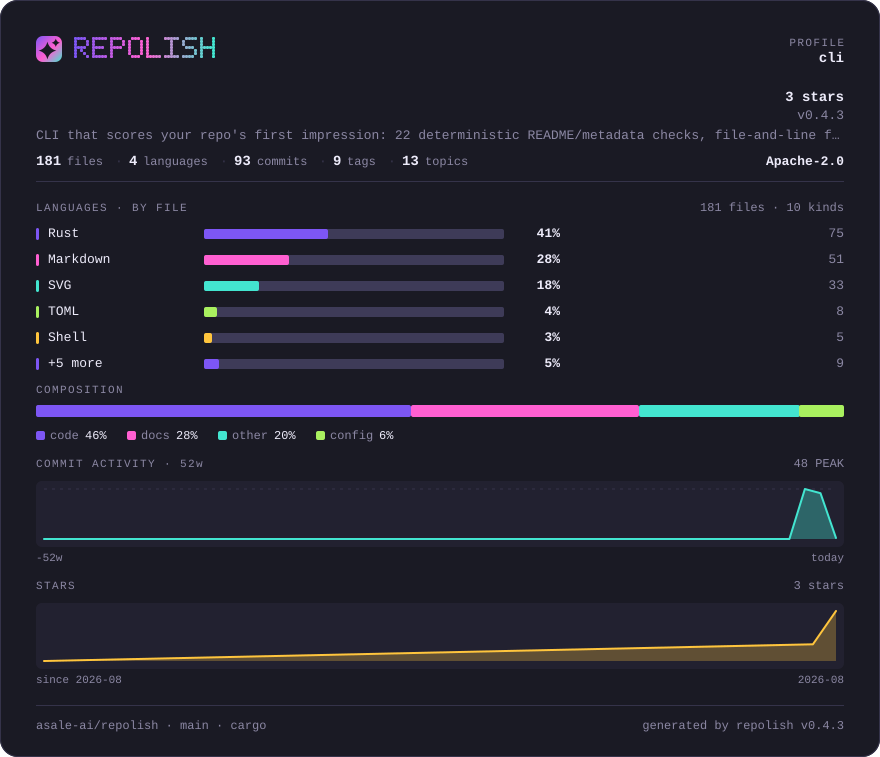
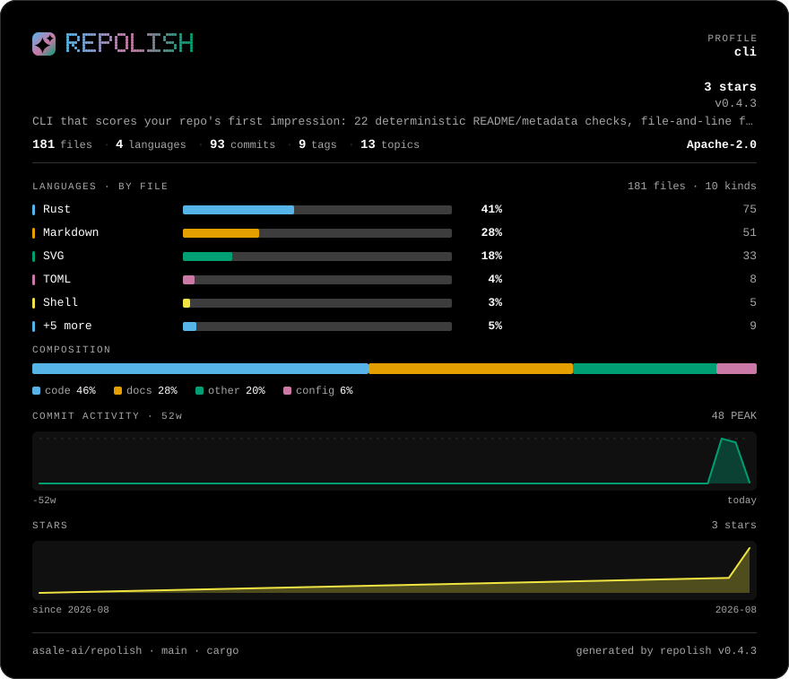
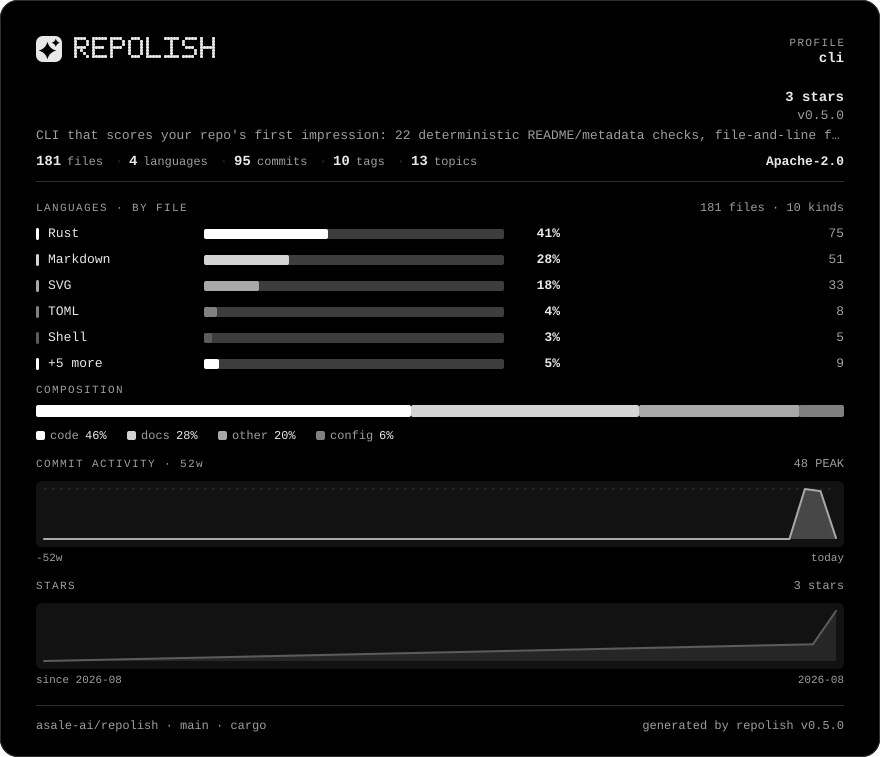
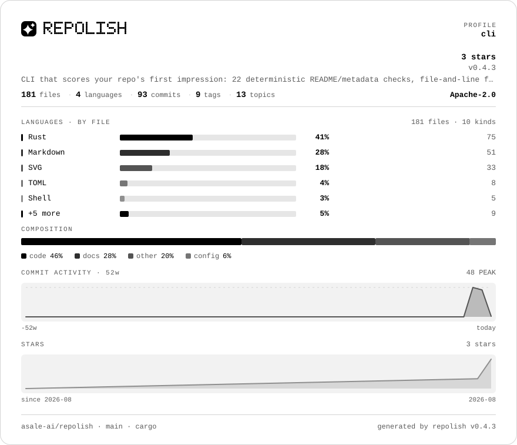

# Palettes

Every palette `--theme` accepts, each rendered on this repository's own overview card.
Nothing here is a mock-up: each image is what `repolish --theme <name>` writes.

[English](README.md) · [中文](README.zh-CN.md) · [Design notes](../README.md)

| Palette | | What it is |
|---|---|---|
| [`dark`](dark/README.md) | dark | Neon on near-black — the default, and the same palette as the terminal report |
| [`porcelain`](porcelain/README.md) | light | Warm paper, dark ink |
| [`slate`](slate/README.md) | dark | GitHub's own dark blue-grey |
| [`nord`](nord/README.md) | dark | Nordic and desaturated |
| [`ember`](ember/README.md) | dark | Gruvbox: warm brown, amber and olive |
| [`solar`](solar/README.md) | dark | Solarized dark, unmodified |
| [`phosphor`](phosphor/README.md) | dark | One green, five brightnesses |
| [`blueprint`](blueprint/README.md) | dark | Drafting blue with cold white rules |
| [`okabe`](okabe/README.md) | dark | Okabe–Ito on pure black |
| [`newsprint`](newsprint/README.md) | light | Greyscale with a single red |
| [`sakura`](sakura/README.md) | light | Soft rose paper |
| [`glacier`](glacier/README.md) | light | Light and cold, where porcelain is light and warm |
| [`carbon`](carbon/README.md) | dark | White on black. No hue anywhere, and no gradient |
| [`paper`](paper/README.md) | light | Black on white. Carbon inverted |

```bash
repolish --apply --theme nord
```

All of them pass the same contrast tests: body text at 7:1 against the background,
secondary text at 4.5:1, and every score band at 3:1. Picking a palette changes how the
card looks and nothing else — **no palette can change a score**.

<a href="dark/README.md"></a>
<a href="porcelain/README.md"></a>
<a href="slate/README.md"></a>
<a href="nord/README.md"></a>
<a href="ember/README.md"></a>
<a href="solar/README.md"></a>
<a href="phosphor/README.md"></a>
<a href="blueprint/README.md"></a>
<a href="okabe/README.md"></a>
<a href="newsprint/README.md"></a>
<a href="sakura/README.md"></a>
<a href="glacier/README.md"></a>
<a href="carbon/README.md"></a>
<a href="paper/README.md"></a>
