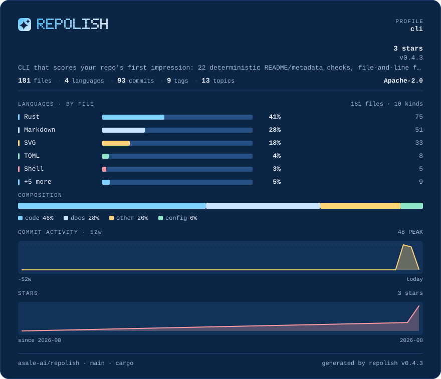

# blueprint

**Drafting blue with cold white rules** · Dark

[English](README.md) · [中文](README.zh-CN.md) · [All palettes](../README.md)



```bash
repolish --apply --theme blueprint
```

```toml
# .repolish.toml
[readme]
theme = "blueprint"
```

## Why this one

Deep blue, cold white, pale cyan — a blueprint. Hardware, protocol and architecture READMEs usually already carry a diagram or two; the card lines up with those better than it lines up with our brand colours.

Body text sits at **13.7:1** against the background and secondary text at
**7.4:1** — the thresholds the palette tests enforce are 7:1 and 4.5:1, and
every band colour clears 3:1. A card nobody can read is not a style choice.

## The report card


## Every colour

| Role | Hex | Contrast on the background |
|---|---|---|
| Background | `#0b2545` | — |
| Panel | `#123258` | 1.2:1 |
| Body text | `#eaf2ff` | 13.7:1 |
| Secondary text | `#9db6d8` | 7.4:1 |
| Rules | `#1d4171` | 1.5:1 |
| Bar track | `#264f84` | 1.9:1 |
| Warning | `#ffd479` | 11.0:1 |
| Failure | `#ff8a94` | 6.8:1 |
| Brand 1 | `#4cc3ff` | 7.7:1 |
| Brand 2 | `#9ad7ff` | 9.9:1 |
| Brand 3 | `#eaf2ff` | 13.7:1 |
| Series 1 | `#7fd1ff` | 9.1:1 |
| Series 2 | `#c9e4ff` | 11.7:1 |
| Series 3 | `#ffd479` | 11.0:1 |
| Series 4 | `#8ee6c8` | 10.5:1 |
| Series 5 | `#ff9aa2` | 7.6:1 |
| Band 1 (excellent) | `#7fd1ff` | 9.1:1 |
| Band 2 (good) | `#8ee6c8` | 10.5:1 |
| Band 3 (fair) | `#ffd479` | 11.0:1 |
| Band 4 (weak) | `#ffab6b` | 8.3:1 |
| Band 5 (poor) | `#ff8a94` | 6.8:1 |

---

Rendered by `scripts/render-themes.py` from [`theme.rs`](../../../crates/repolish-render/src/theme.rs),
which is the only place these values exist.
