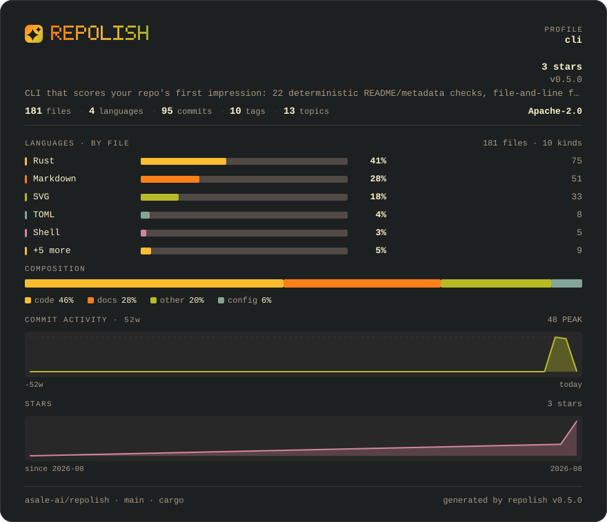

# ember

**Gruvbox: warm brown, amber and olive** · Dark

[English](README.md) · [中文](README.zh-CN.md) · [All palettes](../README.md)



```bash
repolish --apply --theme ember
```

```toml
# .repolish.toml
[readme]
theme = "ember"
```

`--theme` and `.repolish.toml` also accept `gruvbox`.

## Why this one

The one warm dark palette. Amber and olive on brown-black is what an old terminal looked like, and what the Rust / C / systems crowd has been staring at for years. People who recognise it read the card as made by one of their own.

Body text sits at **14.5:1** against the background and secondary text at
**5.9:1** — the thresholds the palette tests enforce are 7:1 and 4.5:1, and
every band colour clears 3:1. A card nobody can read is not a style choice.

## The report card


## Every colour

| Role | Hex | Contrast on the background |
|---|---|---|
| Background | `#1d2021` | — |
| Panel | `#282828` | 1.1:1 |
| Body text | `#fbf1c7` | 14.5:1 |
| Secondary text | `#a89984` | 5.9:1 |
| Rules | `#3c3836` | 1.4:1 |
| Bar track | `#504945` | 1.9:1 |
| Warning | `#fabd2f` | 9.7:1 |
| Failure | `#fb4934` | 4.8:1 |
| Brand 1 | `#fe8019` | 6.5:1 |
| Brand 2 | `#fabd2f` | 9.7:1 |
| Brand 3 | `#b8bb26` | 7.9:1 |
| Series 1 | `#fabd2f` | 9.7:1 |
| Series 2 | `#fe8019` | 6.5:1 |
| Series 3 | `#b8bb26` | 7.9:1 |
| Series 4 | `#83a598` | 6.1:1 |
| Series 5 | `#d3869b` | 6.0:1 |
| Band 1 (excellent) | `#8ec07c` | 7.8:1 |
| Band 2 (good) | `#b8bb26` | 7.9:1 |
| Band 3 (fair) | `#fabd2f` | 9.7:1 |
| Band 4 (weak) | `#fe8019` | 6.5:1 |
| Band 5 (poor) | `#fb4934` | 4.8:1 |

---

Rendered by `scripts/render-themes.py` from [`theme.rs`](../../../crates/repolish-render/src/theme.rs),
which is the only place these values exist.
