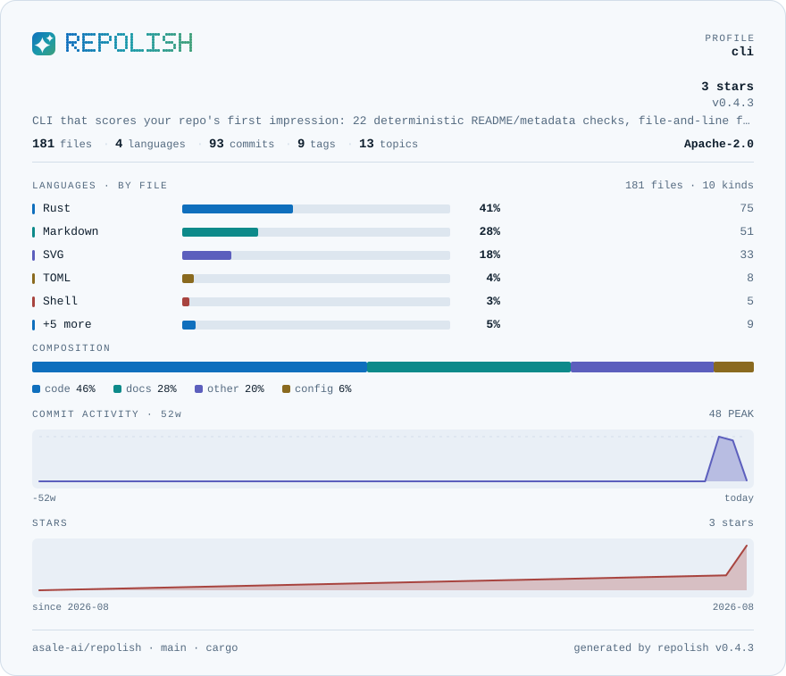
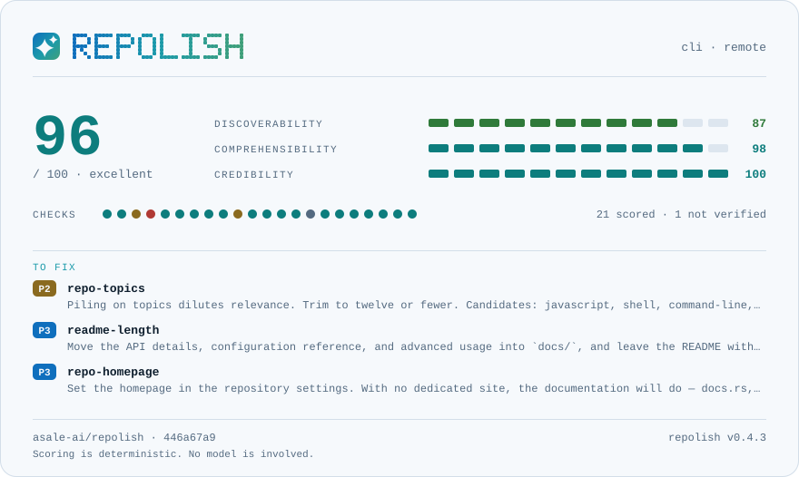

# glacier

**冷调近白，与暖调的 porcelain 互补** · 浅色

[English](README.md) · [中文](README.zh-CN.md) · [全部色板](../README.zh-CN.md)



```bash
repolish --apply --theme glacier
```

```toml
# .repolish.toml
[readme]
theme = "glacier"
```

`--theme` 与 `.repolish.toml` 同样接受 `ice`。

## 为什么有这一套

`porcelain` 配米色、木色、衬线字的版面，这一套配蓝色系的版面。浅色只有一套时，一半的 README 只能将就。

正文与底色的对比度是 **15.8:1**，弱色文字是 **5.3:1**——色板测试卡住的线是
7:1 和 4.5:1，每一档分数色都过 3:1。一张读不清的卡片不叫风格。

## 报告卡片



## 全部用色

| 用途 | 色值 | 与底色的对比度 |
|---|---|---|
| 卡片底色 | `#f6f9fc` | — |
| 内嵌面板 | `#e9eff6` | 1.1:1 |
| 正文 | `#0f1f2e` | 15.8:1 |
| 弱色文字 | `#546a80` | 5.3:1 |
| 分隔线 | `#d3dee9` | 1.3:1 |
| 条形轨道 | `#dde6ef` | 1.2:1 |
| 警告 | `#8a6a1f` | 4.8:1 |
| 失败 | `#b03a34` | 5.7:1 |
| 品牌渐变 1 | `#0f6fbd` | 4.9:1 |
| 品牌渐变 2 | `#1b9aaa` | 3.2:1 |
| 品牌渐变 3 | `#3f9f7a` | 3.1:1 |
| 序列色 1 | `#0f6fbd` | 4.9:1 |
| 序列色 2 | `#0d8a8a` | 4.0:1 |
| 序列色 3 | `#5c5fbd` | 5.2:1 |
| 序列色 4 | `#8a6a1f` | 4.8:1 |
| 序列色 5 | `#a8443f` | 5.6:1 |
| 第 1 档（优秀） | `#0d7d7d` | 4.7:1 |
| 第 2 档（良好） | `#2f7a3a` | 5.0:1 |
| 第 3 档（及格） | `#8a6a1f` | 4.8:1 |
| 第 4 档（偏弱） | `#b0561c` | 4.7:1 |
| 第 5 档（差） | `#b03a34` | 5.7:1 |

---

由 `scripts/render-themes.py` 从 [`theme.rs`](../../../crates/repolish-render/src/theme.rs)
生成——那里是这些色值唯一存在的地方。
