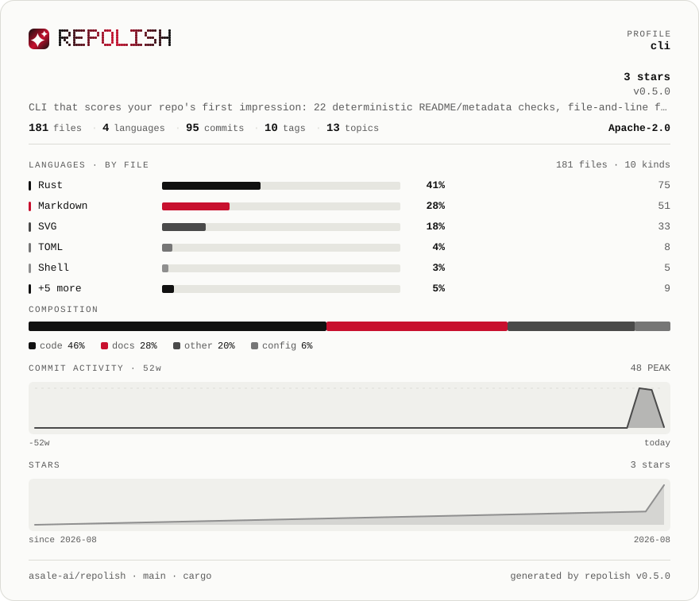

# newsprint

**Greyscale with a single red** · Light

[English](README.md) · [中文](README.zh-CN.md) · [All palettes](../README.md)



```bash
repolish --apply --theme newsprint
```

```toml
# .repolish.toml
[readme]
theme = "newsprint"
```

`--theme` and `.repolish.toml` also accept `swiss`.

## Why this one

Light. The series colours are a grey ramp and only the emphasis is red, like a page of newsprint or an annual report. For projects whose card should read as a document rather than as an interface.

Body text sits at **18.2:1** against the background and secondary text at
**6.5:1** — the thresholds the palette tests enforce are 7:1 and 4.5:1, and
every band colour clears 3:1. A card nobody can read is not a style choice.

## The report card


## Every colour

| Role | Hex | Contrast on the background |
|---|---|---|
| Background | `#fbfbf9` | — |
| Panel | `#f0f0ec` | 1.1:1 |
| Body text | `#111111` | 18.2:1 |
| Secondary text | `#5c5c5c` | 6.5:1 |
| Rules | `#dcdcd6` | 1.3:1 |
| Bar track | `#e6e6e0` | 1.2:1 |
| Warning | `#a35a00` | 5.0:1 |
| Failure | `#c8102e` | 5.7:1 |
| Brand 1 | `#111111` | 18.2:1 |
| Brand 2 | `#c8102e` | 5.7:1 |
| Brand 3 | `#111111` | 18.2:1 |
| Series 1 | `#111111` | 18.2:1 |
| Series 2 | `#c8102e` | 5.7:1 |
| Series 3 | `#4a4a4a` | 8.6:1 |
| Series 4 | `#767676` | 4.4:1 |
| Series 5 | `#8f8f8f` | 3.1:1 |
| Band 1 (excellent) | `#0f6b57` | 6.2:1 |
| Band 2 (good) | `#3f7a1f` | 5.0:1 |
| Band 3 (fair) | `#a35a00` | 5.0:1 |
| Band 4 (weak) | `#b8480f` | 5.1:1 |
| Band 5 (poor) | `#c8102e` | 5.7:1 |

---

Rendered by `scripts/render-themes.py` from [`theme.rs`](../../../crates/repolish-render/src/theme.rs),
which is the only place these values exist.
