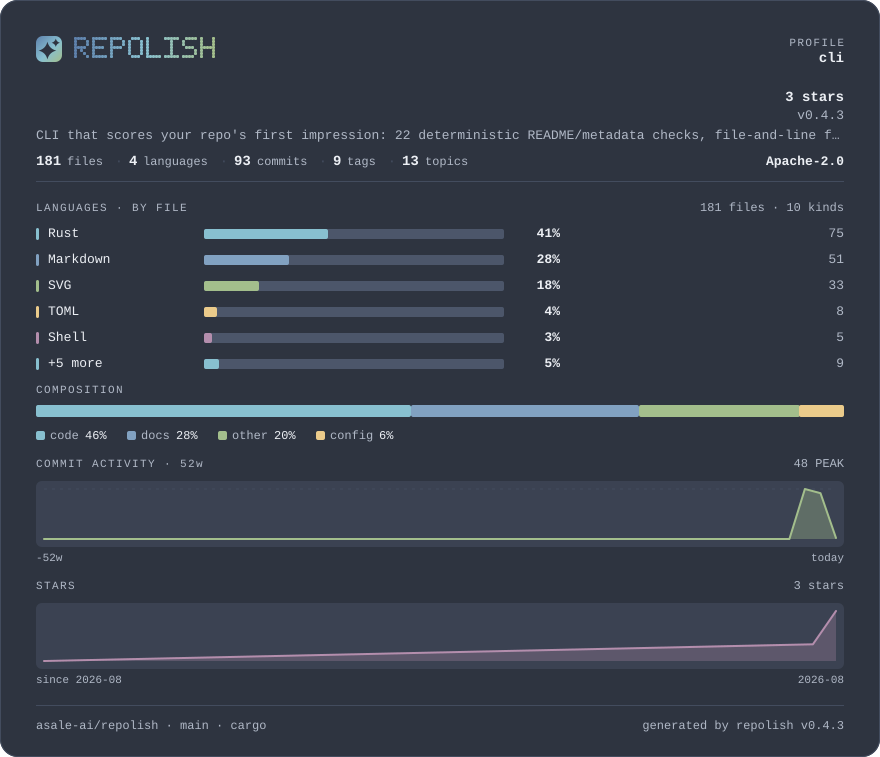
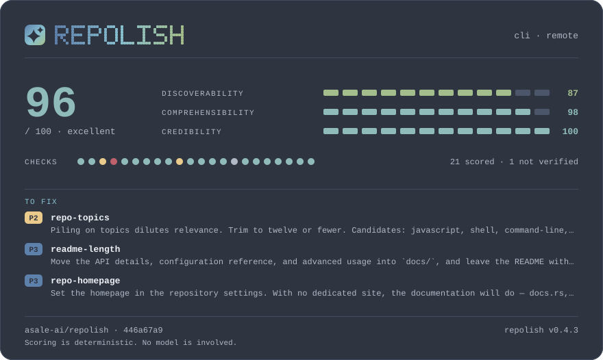

# nord

**北欧低饱和，冷静不刺眼** · 深色

[English](README.md) · [中文](README.zh-CN.md) · [全部色板](../README.zh-CN.md)



```bash
repolish --apply --theme nord
```

```toml
# .repolish.toml
[readme]
theme = "nord"
```

## 为什么有这一套

所有色相都被压回中灰。文档站、基础设施、库——这些项目的卡片该是配角，`nord` 是给它们的。

正文与底色的对比度是 **10.8:1**，弱色文字是 **6.3:1**——色板测试卡住的线是
7:1 和 4.5:1，每一档分数色都过 3:1。一张读不清的卡片不叫风格。

## 报告卡片



## 全部用色

| 用途 | 色值 | 与底色的对比度 |
|---|---|---|
| 卡片底色 | `#2e3440` | — |
| 内嵌面板 | `#3b4252` | 1.2:1 |
| 正文 | `#eceff4` | 10.8:1 |
| 弱色文字 | `#b0b8c6` | 6.3:1 |
| 分隔线 | `#434c5e` | 1.4:1 |
| 条形轨道 | `#4c566a` | 1.7:1 |
| 警告 | `#ebcb8b` | 8.0:1 |
| 失败 | `#bf616a` | 3.1:1 |
| 品牌渐变 1 | `#5e81ac` | 3.1:1 |
| 品牌渐变 2 | `#88c0d0` | 6.2:1 |
| 品牌渐变 3 | `#a3be8c` | 6.1:1 |
| 序列色 1 | `#88c0d0` | 6.2:1 |
| 序列色 2 | `#81a1c1` | 4.6:1 |
| 序列色 3 | `#a3be8c` | 6.1:1 |
| 序列色 4 | `#ebcb8b` | 8.0:1 |
| 序列色 5 | `#b48ead` | 4.4:1 |
| 第 1 档（优秀） | `#8fbcbb` | 6.0:1 |
| 第 2 档（良好） | `#a3be8c` | 6.1:1 |
| 第 3 档（及格） | `#ebcb8b` | 8.0:1 |
| 第 4 档（偏弱） | `#d08770` | 4.4:1 |
| 第 5 档（差） | `#bf616a` | 3.1:1 |

---

由 `scripts/render-themes.py` 从 [`theme.rs`](../../../crates/repolish-render/src/theme.rs)
生成——那里是这些色值唯一存在的地方。
