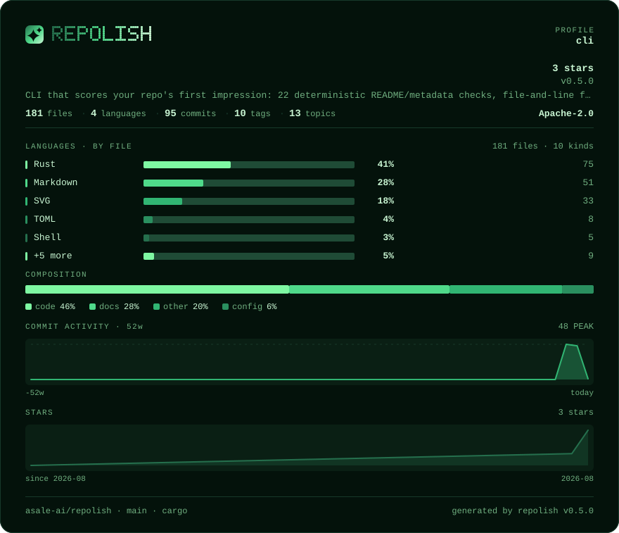

# phosphor

**One green, five brightnesses** · Dark

[English](README.md) · [中文](README.zh-CN.md) · [All palettes](../README.md)



```bash
repolish --apply --theme phosphor
```

```toml
# .repolish.toml
[readme]
theme = "phosphor"
```

`--theme` and `.repolish.toml` also accept `crt`, `mono`.

## Why this one

There is no second hue. The series colours are a brightness ramp, so the card still separates when it is printed in black and white — a chart that separates by hue alone turns into one grey smear. The error colour is the deliberate exception: a failure has to be red.

Body text sits at **15.9:1** against the background and secondary text at
**7.3:1** — the thresholds the palette tests enforce are 7:1 and 4.5:1, and
every band colour clears 3:1. A card nobody can read is not a style choice.

## The report card


## Every colour

| Role | Hex | Contrast on the background |
|---|---|---|
| Background | `#04120b` | — |
| Panel | `#0a1f14` | 1.1:1 |
| Body text | `#c8f5d2` | 15.9:1 |
| Secondary text | `#6fae7f` | 7.3:1 |
| Rules | `#17392a` | 1.5:1 |
| Bar track | `#1f4b36` | 1.9:1 |
| Warning | `#b7f56a` | 14.8:1 |
| Failure | `#ff6b6b` | 6.9:1 |
| Brand 1 | `#256f4d` | 3.2:1 |
| Brand 2 | `#4fd98a` | 10.6:1 |
| Brand 3 | `#c8f5d2` | 15.9:1 |
| Series 1 | `#7ef7a2` | 14.3:1 |
| Series 2 | `#4fd98a` | 10.6:1 |
| Series 3 | `#31b573` | 7.3:1 |
| Series 4 | `#2a8f5f` | 4.7:1 |
| Series 5 | `#256f4d` | 3.2:1 |
| Band 1 (excellent) | `#7ef7a2` | 14.3:1 |
| Band 2 (good) | `#4fd98a` | 10.6:1 |
| Band 3 (fair) | `#31b573` | 7.3:1 |
| Band 4 (weak) | `#8fbf5a` | 8.9:1 |
| Band 5 (poor) | `#ff6b6b` | 6.9:1 |

---

Rendered by `scripts/render-themes.py` from [`theme.rs`](../../../crates/repolish-render/src/theme.rs),
which is the only place these values exist.
