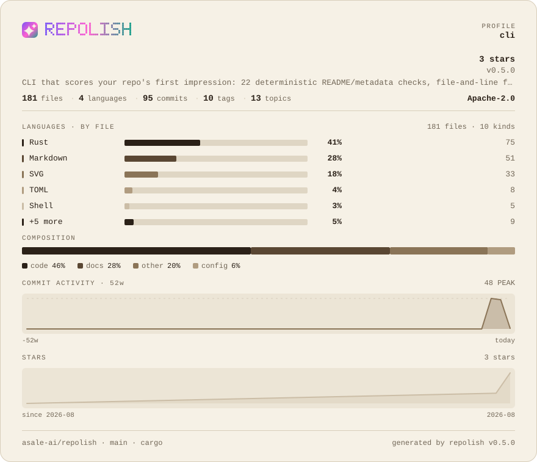

# porcelain

**Warm paper, dark ink** · Light

[English](README.md) · [中文](README.zh-CN.md) · [All palettes](../README.md)



```bash
repolish --apply --theme porcelain
```

```toml
# .repolish.toml
[readme]
theme = "porcelain"
```

`--theme` and `.repolish.toml` also accept `light`, `cream`.

## Why this one

It exists for readability, not taste: a dark card dropped into a light README is a hole in the page. The series colours are a lightness ramp rather than five hues — neon smears together on paper.

Body text sits at **14.0:1** against the background and secondary text at
**5.0:1** — the thresholds the palette tests enforce are 7:1 and 4.5:1, and
every band colour clears 3:1. A card nobody can read is not a style choice.

## The report card


## Every colour

| Role | Hex | Contrast on the background |
|---|---|---|
| Background | `#f6f1e6` | — |
| Panel | `#ece5d6` | 1.1:1 |
| Body text | `#2b2118` | 14.0:1 |
| Secondary text | `#716656` | 5.0:1 |
| Rules | `#d8cebb` | 1.4:1 |
| Bar track | `#dfd6c4` | 1.3:1 |
| Warning | `#b57a0b` | 3.2:1 |
| Failure | `#b4332b` | 5.4:1 |
| Brand 1 | `#7d56f4` | 4.1:1 |
| Brand 2 | `#ff5fd1` | 2.4:1 |
| Brand 3 | `#1e9e8c` | 2.9:1 |
| Series 1 | `#2b2118` | 14.0:1 |
| Series 2 | `#5a4733` | 7.8:1 |
| Series 3 | `#8a7457` | 4.0:1 |
| Series 4 | `#b09c80` | 2.4:1 |
| Series 5 | `#cbbda6` | 1.6:1 |
| Band 1 (excellent) | `#1e6f63` | 5.3:1 |
| Band 2 (good) | `#4b7a27` | 4.5:1 |
| Band 3 (fair) | `#b57a0b` | 3.2:1 |
| Band 4 (weak) | `#c05c1e` | 3.9:1 |
| Band 5 (poor) | `#b4332b` | 5.4:1 |

---

Rendered by `scripts/render-themes.py` from [`theme.rs`](../../../crates/repolish-render/src/theme.rs),
which is the only place these values exist.
