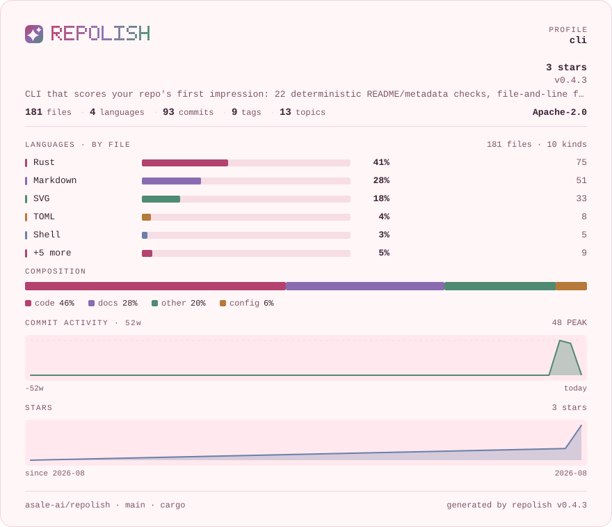

# sakura

**柔和粉彩纸底** · 浅色

[English](README.md) · [中文](README.zh-CN.md) · [全部色板](../README.zh-CN.md)



```bash
repolish --apply --theme sakura
```

```toml
# .repolish.toml
[readme]
theme = "sakura"
```

`--theme` 与 `.repolish.toml` 同样接受 `pastel`。

## 为什么有这一套

浅色里最温和的一套。玫瑰、薰衣草、鼠尾草都压过明度，在粉白纸上不刺眼。设计工具、内容项目、面向非工程读者的仓库——它们的 README 通常也是这个温度，卡片不该是那一页上唯一硬的东西。

正文与底色的对比度是 **13.7:1**，弱色文字是 **5.9:1**——色板测试卡住的线是
7:1 和 4.5:1，每一档分数色都过 3:1。一张读不清的卡片不叫风格。

## 报告卡片


## 全部用色

| 用途 | 色值 | 与底色的对比度 |
|---|---|---|
| 卡片底色 | `#fff6f8` | — |
| 内嵌面板 | `#ffe9ee` | 1.1:1 |
| 正文 | `#3a2130` | 13.7:1 |
| 弱色文字 | `#7d5566` | 5.9:1 |
| 分隔线 | `#f3d3dc` | 1.3:1 |
| 条形轨道 | `#f7dde4` | 1.2:1 |
| 警告 | `#a86a12` | 4.2:1 |
| 失败 | `#c03952` | 5.0:1 |
| 品牌渐变 1 | `#b3436e` | 5.0:1 |
| 品牌渐变 2 | `#8a6bb0` | 4.1:1 |
| 品牌渐变 3 | `#4f8a72` | 3.8:1 |
| 序列色 1 | `#b3436e` | 5.0:1 |
| 序列色 2 | `#8a6bb0` | 4.1:1 |
| 序列色 3 | `#4f8a72` | 3.8:1 |
| 序列色 4 | `#b5793a` | 3.4:1 |
| 序列色 5 | `#6b7fa8` | 3.8:1 |
| 第 1 档（优秀） | `#2f7f6c` | 4.5:1 |
| 第 2 档（良好） | `#4f8a3a` | 3.9:1 |
| 第 3 档（及格） | `#a86a12` | 4.2:1 |
| 第 4 档（偏弱） | `#bd5c22` | 4.2:1 |
| 第 5 档（差） | `#c03952` | 5.0:1 |

---

由 `scripts/render-themes.py` 从 [`theme.rs`](../../../crates/repolish-render/src/theme.rs)
生成——那里是这些色值唯一存在的地方。
