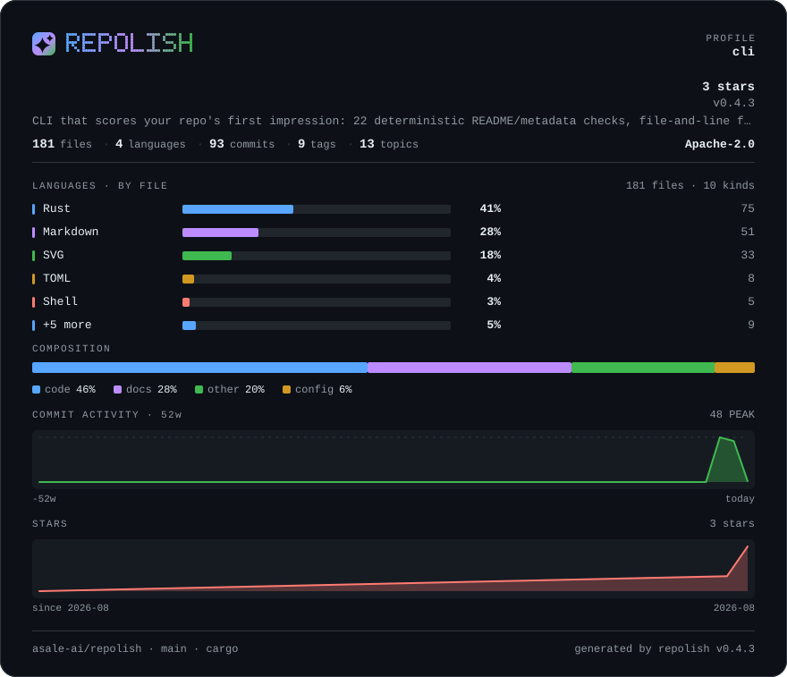
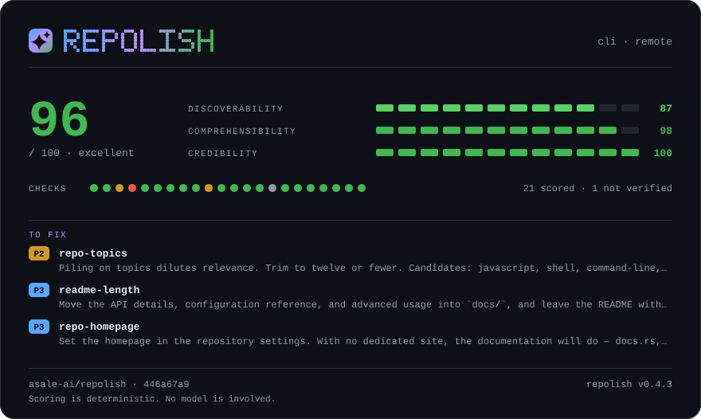

# slate

**GitHub 深色主题同源的蓝灰** · 深色

[English](README.md) · [中文](README.zh-CN.md) · [全部色板](../README.zh-CN.md)



```bash
repolish --apply --theme slate
```

```toml
# .repolish.toml
[readme]
theme = "slate"
```

`--theme` 与 `.repolish.toml` 同样接受 `github`。

## 为什么有这一套

GitHub 上最保险的一张。底色与它周围的页面同源，卡片看上去是页面的一部分，而不是谁贴进来的一张图。它没有主张——大多数仓库要的其实正是这个。

正文与底色的对比度是 **16.0:1**，弱色文字是 **6.5:1**——色板测试卡住的线是
7:1 和 4.5:1，每一档分数色都过 3:1。一张读不清的卡片不叫风格。

## 报告卡片



## 全部用色

| 用途 | 色值 | 与底色的对比度 |
|---|---|---|
| 卡片底色 | `#0d1117` | — |
| 内嵌面板 | `#161b22` | 1.1:1 |
| 正文 | `#e6edf3` | 16.0:1 |
| 弱色文字 | `#9198a1` | 6.5:1 |
| 分隔线 | `#30363d` | 1.6:1 |
| 条形轨道 | `#21262d` | 1.2:1 |
| 警告 | `#d29922` | 7.5:1 |
| 失败 | `#f85149` | 5.6:1 |
| 品牌渐变 1 | `#58a6ff` | 7.5:1 |
| 品牌渐变 2 | `#bc8cff` | 7.5:1 |
| 品牌渐变 3 | `#3fb950` | 7.4:1 |
| 序列色 1 | `#58a6ff` | 7.5:1 |
| 序列色 2 | `#bc8cff` | 7.5:1 |
| 序列色 3 | `#3fb950` | 7.4:1 |
| 序列色 4 | `#d29922` | 7.5:1 |
| 序列色 5 | `#ff7b72` | 7.5:1 |
| 第 1 档（优秀） | `#3fb950` | 7.4:1 |
| 第 2 档（良好） | `#56d364` | 9.8:1 |
| 第 3 档（及格） | `#d29922` | 7.5:1 |
| 第 4 档（偏弱） | `#db6d28` | 5.6:1 |
| 第 5 档（差） | `#f85149` | 5.6:1 |

---

由 `scripts/render-themes.py` 从 [`theme.rs`](../../../crates/repolish-render/src/theme.rs)
生成——那里是这些色值唯一存在的地方。
