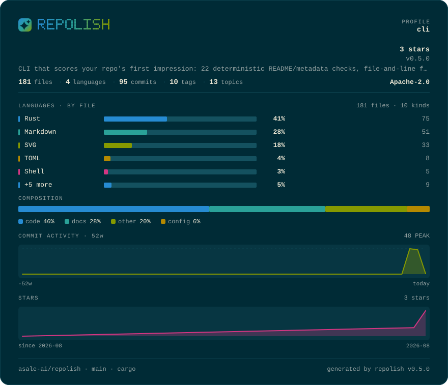

# solar

**Solarized dark, unmodified** · Dark

[English](README.md) · [中文](README.zh-CN.md) · [All palettes](../README.md)



```bash
repolish --apply --theme solar
```

```toml
# .repolish.toml
[readme]
theme = "solar"
```

`--theme` and `.repolish.toml` also accept `solarized`.

## Why this one

Six low-saturation hues against a fixed neutral ramp, frozen since 2011 and still the default skin in a great many editors. The values are copied exactly: adjust them and it is no longer Solarized, just a green that resembles it.

Body text sits at **12.3:1** against the background and secondary text at
**5.6:1** — the thresholds the palette tests enforce are 7:1 and 4.5:1, and
every band colour clears 3:1. A card nobody can read is not a style choice.

## The report card


## Every colour

| Role | Hex | Contrast on the background |
|---|---|---|
| Background | `#002b36` | — |
| Panel | `#073642` | 1.2:1 |
| Body text | `#eee8d5` | 12.3:1 |
| Secondary text | `#93a1a1` | 5.6:1 |
| Rules | `#0e4552` | 1.4:1 |
| Bar track | `#14515f` | 1.7:1 |
| Warning | `#b58900` | 4.7:1 |
| Failure | `#dc322f` | 3.2:1 |
| Brand 1 | `#268bd2` | 4.1:1 |
| Brand 2 | `#2aa198` | 4.8:1 |
| Brand 3 | `#859900` | 4.7:1 |
| Series 1 | `#268bd2` | 4.1:1 |
| Series 2 | `#2aa198` | 4.8:1 |
| Series 3 | `#859900` | 4.7:1 |
| Series 4 | `#b58900` | 4.7:1 |
| Series 5 | `#d33682` | 3.3:1 |
| Band 1 (excellent) | `#2aa198` | 4.8:1 |
| Band 2 (good) | `#859900` | 4.7:1 |
| Band 3 (fair) | `#b58900` | 4.7:1 |
| Band 4 (weak) | `#cb4b16` | 3.3:1 |
| Band 5 (poor) | `#dc322f` | 3.2:1 |

---

Rendered by `scripts/render-themes.py` from [`theme.rs`](../../../crates/repolish-render/src/theme.rs),
which is the only place these values exist.
